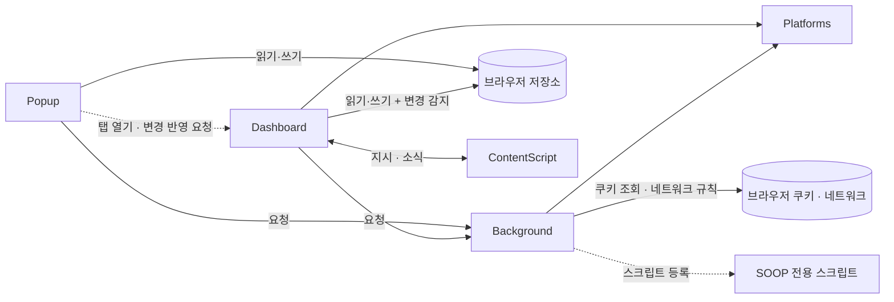

[설계서](../README.md) › Architecture

# Architecture

> **다루는 내용:** 계층 구성 · 의존 방향 · 통신 규칙
> **갱신 트리거:** 계층이 추가·제거되거나 계층 간 통신 방식이 바뀔 때

## 본문

### 계층 구성

계층 이름을 누르면 해당 모듈의 책임·계약 문서로 이동한다. 이 표가 하위 문서 목록을 겸한다.

| 계층 | 실행 컨텍스트 | 역할 |
|---|---|---|
| [Background](Background.md) | Service Worker | 로그인 세션 쿠키 주입, 팔로잉/생방송 상태 API 대리 호출 |
| [Popup](Popup.md) | 팝업 페이지 | 시청 목록·즐겨찾기·설정 관리, 대시보드 열기 |
| [Dashboard](Dashboard.md) | 대시보드 탭 | 멀티뷰 화면 조립, 스왑, 자동 동기화, 레이아웃 |
| [Platforms](Platforms.md) | Background · Dashboard에 각각 로드되는 공유 라이브러리 | 치지직/SOOP 차이를 동일 인터페이스로 흡수 |

- 방송 페이지 iframe 안에서 도는 [ContentScript](ContentScript.md)도 별도 실행 컨텍스트이지만, Dashboard가 만든 iframe 안에서만 동작하고 Dashboard와만 대화하므로 [Dashboard](Dashboard.md)의 하위 문서로 둔다. 다만 SOOP MAIN 월드 스크립트를 등록하는 쪽은 Background다.
- Background와 Platforms는 Popup·Dashboard 양쪽이 쓰는 공유 계층이라 특정 계층의 하위에 두지 않는다.

### 의존 방향



- Platforms는 Background와 Dashboard 양쪽에 각각 로드되는 공유 계층으로, 역방향 의존이 없다.
- Popup은 Platforms를 로드하지 않는다. 팔로잉·생방송 상태가 필요하면 반드시 Background를 거친다.
- ContentScript는 Background·Popup과 직접 연결되지 않고, 오직 자신을 담고 있는 Dashboard와만 대화한다.

### 통신 규칙

| 구간 | 방식 | 용도 |
|---|---|---|
| Popup → Background | 요청·응답 | 팔로잉 목록 · 생방송 상태 · SOOP 로그인 여부 조회 |
| Popup ↔ 브라우저 저장소 | 읽기·쓰기 | 시청 목록 · 즐겨찾기 · 설정 |
| Popup → Dashboard 탭 | 요청 | 대시보드가 이미 열려 있을 때 변경사항 반영 |
| Dashboard → Background | 요청·응답 | 생방송 상태 · 프로필 사진 조회 |
| Dashboard ↔ 브라우저 저장소 | 읽기·쓰기 + 변경 감지 | 시청 목록·배치 읽기, 설정 변경 실시간 반영 |
| Dashboard ↔ 방송 화면 | 지시·소식 | 음량 제어, 딜레이·광고 상태 수신, 넓은 화면 재시도 요청 |
| Background ↔ 브라우저 | 쿠키 조회 · 네트워크 규칙 | 로그인 쿠키를 읽어 방송 화면·조회 요청에 실어 보냄 |
| Background → SOOP 전용 스크립트 | 스크립트 등록 | SOOP 방송 화면의 로컬 앱 연결 차단 |

**주의**
- ⚠️ 브라우저는 확장 프로그램이 만든 화면에 로그인 쿠키를 자동으로 실어 주지 않는다. Background가 네트워크 규칙으로 직접 실어 보내 이를 우회한다.

### 공유 상태

Popup과 Dashboard가 직접 연결되어 있지 않을 때도 브라우저 저장소를 매개로 상태를 공유한다.

| 저장하는 것 | 내용 | 주로 쓰는 쪽 |
|---|---|---|
| 시청 목록 | 시청 중인 채널 순서. **맨 앞이 메인** | Popup(읽기·쓰기) · Dashboard(읽기 + 교체·순서 변경·삭제 시 쓰기) |
| 즐겨찾기 트리 | 폴더 구조로 보관한 채널 | Popup |
| 구 형식 즐겨찾기 | 예전 버전이 남긴 목록. 트리가 없을 때만 읽어 트리로 옮긴다 | Popup(읽기) |
| 시스템 설정 | 자동 동기화 여부·기준 시간·서브 정보 표시 방식. 읽을 때 예전 형식 값을 현재 체계로 바꾼다 | Popup(쓰기) · Dashboard(읽기, 변경 시 실시간 반영) |
| 대시보드 배치 | 선택한 배치 종류 | Popup(쓰기) · Dashboard(읽기) |
| 화면 상태 | 채팅 숨김 여부, 서브 영역 접힘·높이 | Dashboard |

### 기술 스택

- Chrome 확장 프로그램 (Manifest V3)
- 순수 JS — 프레임워크·번들러 없음
- 네트워크 규칙 변조 — 확장 프로그램 화면에 로그인 쿠키를 실어 보내기 위해
- 브라우저 저장소 — 시청 목록 / 즐겨찾기 / 설정 영구 보관
- 화면 간 메시지 — 대시보드와 방송 화면 사이 음량 제어·상태 수신

### 참고: 구현 파일 위치

아래는 위 계층·모듈이 현재 어느 파일에 있는지 보여주는 색인이다. 계층별 책임과 계약은 위 본문과 하위 문서를 기준으로 하고, **이 트리는 파일이 바뀌어도 갱신 의무가 없는 참고용**이다.

```
source/
├── manifest.json          권한 선언, content_scripts 등록
├── background.js          [Background] 쿠키 주입 규칙, 팔로잉·생방송 API fetch 대리
├── content.js             [ContentScript · 격리 월드] 볼륨 제어, 딜레이 측정, 와이드 모드, 채팅 접기
├── content-soop-main.js   [ContentScript · MAIN 월드] SOOP 로컬 앱 연결 요청 차단
├── platforms/             [Platforms]
│   ├── chzzk.js           치지직 어댑터 (생방송 상태, 프로필, 팔로잉, 채팅 URL)
│   ├── soop.js            SOOP 어댑터 (생방송 상태, 프로필, 팔로잉)
│   └── index.js           어댑터 진입점 (getPlatform)
├── popup.html             [Popup] 팝업 UI (시청목록 / 기타설정 2탭)
├── popup/
│   ├── main.js            DOM 초기화, 탭·버튼 이벤트, 알림 표시
│   ├── storage.js         스토리지 로드/저장, 시청 목록 삭제·이동·복사, 즐겨찾기 트리 로드/저장
│   ├── watchlist.js       시청 목록 렌더링, 직접 추가 이벤트
│   ├── favorite-tree.js   즐겨찾기 폴더 트리 렌더링 및 드래그앤드롭
│   ├── following.js       팔로잉 목록 불러오기 및 렌더링
│   └── settings.js        설정 저장, 레이아웃 선택 이벤트
├── dashboard.html         [Dashboard] 멀티뷰 대시보드 UI
├── dashboard/
│   ├── main.js            DOM 초기화, 공유 상태, 버튼 이벤트, 딜레이 수신
│   ├── player.js          iframe 생성, 메인/서브 플레이어, 서브 타일 생성
│   ├── control.js         메인 ↔ 서브 스왑, 자동 동기화, 레이아웃/패널 접기
│   └── chat.js            채팅 iframe 세팅 및 숨김 상태 복원
└── resources/
    ├── main_icon_16.png   툴바 아이콘
    ├── main_icon_32.png   HiDPI 툴바 아이콘
    ├── main_icon_48.png   확장 관리 페이지 아이콘
    ├── main_icon_128.png  웹스토어 아이콘
    ├── icon.png           원본 아이콘
    ├── chzzk_icon_16.jpg  팝업 내 치지직 플랫폼 아이콘
    └── soop_icon_16.jpg   팝업 내 SOOP 플랫폼 아이콘
```
