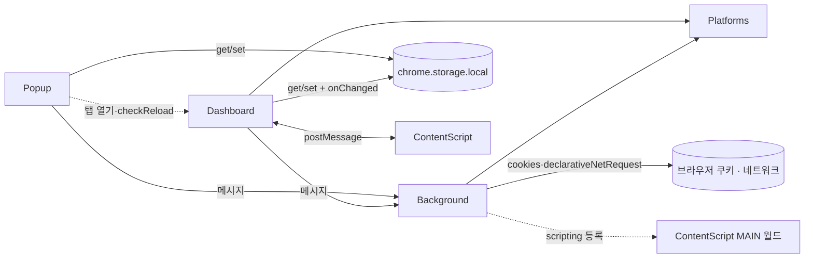

[설계서](../README.md) › Architecture

# Architecture

> **다루는 내용:** 계층 구성 · 의존 방향 · 통신 규칙
> **갱신 트리거:** 계층이 추가·제거되거나 계층 간 통신 방식이 바뀔 때

## 본문

### 계층 구성

계층 이름을 누르면 해당 모듈의 책임·계약 문서로 이동한다. 이 표가 하위 문서 목록을 겸한다.

| 계층 | 실행 컨텍스트 | 역할 |
|---|---|---|
| [Background](Background.md) | Service Worker | 로그인 세션 쿠키 주입, 팔로잉/생방송 상태 API 대리 호출 |
| [Popup](Popup.md) | 팝업 페이지 | 시청 목록·즐겨찾기·설정 관리, 대시보드 열기 |
| [Dashboard](Dashboard.md) | 대시보드 탭 | 멀티뷰 화면 조립, 스왑, 자동 동기화, 레이아웃 |
| ┗ [ContentScript](ContentScript.md) | 방송 페이지 iframe (격리 월드 + SOOP는 MAIN 월드 추가) | 볼륨 제어, 딜레이 측정, 와이드 모드 전환, 채팅 접기, 광고 스킵 |
| [Platforms](Platforms.md) | Background · Dashboard에 각각 로드되는 공유 라이브러리 | 치지직/SOOP 차이를 동일 인터페이스로 흡수 |

- ContentScript는 Dashboard가 만든 iframe 안에서만 동작하고 Dashboard와만 대화하므로 그 하위에 둔다. 다만 SOOP MAIN 월드 스크립트를 등록하는 쪽은 Background다.
- Background와 Platforms는 Popup·Dashboard 양쪽이 쓰는 공유 계층이라 특정 계층의 하위에 두지 않는다.

### 의존 방향



- Platforms는 Background와 Dashboard 양쪽에 각각 로드되는 공유 라이브러리로, 역방향 의존이 없다.
- Popup은 Platforms를 로드하지 않는다. 팔로잉/생방송 상태가 필요하면 반드시 Background를 거친다.
- ContentScript는 Background·Popup과 직접 연결되지 않고, 오직 자신을 iframe으로 담고 있는 Dashboard와만 postMessage로 통신한다.

### 통신 규칙

| 구간 | 방식 | 용도 |
|---|---|---|
| Popup → Background | `chrome.runtime.sendMessage` | 팔로잉 목록 / 생방송 상태 / SOOP 로그인 여부 조회 |
| Popup ↔ chrome.storage.local | get/set | 시청 목록 · 즐겨찾기 · 설정 읽기/쓰기 |
| Popup → Dashboard 탭 | `chrome.tabs.sendMessage` (`checkReload`) | 대시보드가 이미 열려 있을 때 변경사항 반영 요청 |
| Dashboard → Background | `chrome.runtime.sendMessage` | 생방송 상태 · 프로필 사진 조회 |
| Dashboard ↔ chrome.storage.local | get/set + `onChanged` | 시청 목록 · 레이아웃 읽기, 설정 변경 실시간 반영 |
| Dashboard ↔ ContentScript(iframe) | `postMessage` | 볼륨 제어, 딜레이 · 광고 상태 수신, 와이드 모드 재시도 요청 |
| Background ↔ 브라우저 | `chrome.cookies`, `chrome.declarativeNetRequest` | 로그인 세션 쿠키 조회, iframe/API 요청에 쿠키 주입 |
| Background → ContentScript(MAIN 월드) | `chrome.scripting.registerContentScripts` | SOOP iframe 내 로컬 앱 연결 차단 스크립트 등록 |

- ⚠️ `chrome-extension://` 오리진에서는 SameSite=Lax 쿠키가 iframe에 자동으로 실리지 않는다. Background가 `declarativeNetRequest` 동적 규칙으로 Cookie 헤더를 직접 주입해 이를 우회한다.

### chrome.storage.local — 공유 상태

Popup과 Dashboard가 직접 연결되어 있지 않을 때도 아래 키를 매개로 상태를 공유한다.

| 키 | 내용 | 주로 쓰는 쪽 |
|---|---|---|
| `currentViewList` | 시청 목록 배열, 0번 인덱스 = 메인 | Popup(읽기·쓰기) · Dashboard(읽기 + 스왑·서브 순서 변경·삭제 시 쓰기) |
| `favoriteTree` | 즐겨찾기 폴더 트리 | Popup |
| `favoriteMasterList` | 구 형식 즐겨찾기 목록. `favoriteTree`가 없을 때만 읽어 트리로 변환·저장하는 이관용 키 | Popup(읽기) |
| `systemSettings` | 자동 동기화 여부·기준 시간·프로필 표시 방식. 읽을 때 구 형식 프로필 표시값을 현재 4종 체계로 변환한다 | Popup(쓰기) · Dashboard(읽기, `onChanged`로 실시간 반영) |
| `dashboardLayout` | 레이아웃 번호(1~4) | Popup(쓰기) · Dashboard(읽기) |
| `dashboardChatHidden` / `subPanelCollapsed` / `subPanelHeight` | 채팅·서브 패널 UI 상태 | Dashboard |

### 기술 스택

- Chrome Extension Manifest V3
- 순수 JS — 프레임워크·번들러 없음
- `declarativeNetRequest` — SameSite=Lax 쿠키 우회 및 헤더 변조
- `chrome.storage.local` — 시청 목록 / 즐겨찾기 / 설정 영구 저장
- `postMessage` 양방향 통신 — Dashboard ↔ ContentScript(iframe) 볼륨 제어

### 참고: 구현 파일 위치

아래는 위 계층·모듈이 현재 어느 파일에 있는지 보여주는 색인이다. 계층별 책임과 계약은 위 본문과 하위 문서를 기준으로 하고, **이 트리는 파일이 바뀌어도 갱신 의무가 없는 참고용**이다.

```
source/
├── manifest.json          권한 선언, content_scripts 등록
├── background.js          [Background] 쿠키 주입 규칙, 팔로잉·생방송 API fetch 대리
├── content.js             [ContentScript · 격리 월드] 볼륨 제어, 딜레이 측정, 와이드 모드, 채팅 접기
├── content-soop-main.js   [ContentScript · MAIN 월드] SOOP 로컬 앱 연결 요청 차단
├── platforms/             [Platforms]
│   ├── chzzk.js           치지직 어댑터 (생방송 상태, 프로필, 팔로잉, 채팅 URL)
│   ├── soop.js            SOOP 어댑터 (생방송 상태, 프로필, 팔로잉)
│   └── index.js           어댑터 진입점 (getPlatform)
├── popup.html             [Popup] 팝업 UI (시청목록 / 기타설정 2탭)
├── popup/
│   ├── main.js            DOM 초기화, 탭·버튼 이벤트, 알림 표시
│   ├── storage.js         스토리지 로드/저장, 시청 목록 삭제·이동·복사, 즐겨찾기 트리 로드/저장
│   ├── watchlist.js       시청 목록 렌더링, 직접 추가 이벤트
│   ├── favorite-tree.js   즐겨찾기 폴더 트리 렌더링 및 드래그앤드롭
│   ├── following.js       팔로잉 목록 불러오기 및 렌더링
│   └── settings.js        설정 저장, 레이아웃 선택 이벤트
├── dashboard.html         [Dashboard] 멀티뷰 대시보드 UI
├── dashboard/
│   ├── main.js            DOM 초기화, 공유 상태, 버튼 이벤트, 딜레이 수신
│   ├── player.js          iframe 생성, 메인/서브 플레이어, 서브 타일 생성
│   ├── control.js         메인 ↔ 서브 스왑, 자동 동기화, 레이아웃/패널 접기
│   └── chat.js            채팅 iframe 세팅 및 숨김 상태 복원
└── resources/
    ├── main_icon_16.png   툴바 아이콘
    ├── main_icon_32.png   HiDPI 툴바 아이콘
    ├── main_icon_48.png   확장 관리 페이지 아이콘
    ├── main_icon_128.png  웹스토어 아이콘
    ├── icon.png           원본 아이콘
    ├── chzzk_icon_16.jpg  팝업 내 치지직 플랫폼 아이콘
    └── soop_icon_16.jpg   팝업 내 SOOP 플랫폼 아이콘
```
