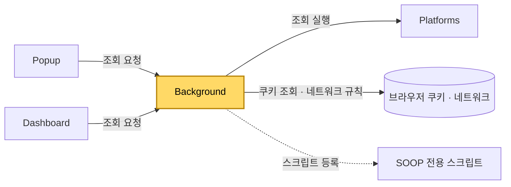

[설계서](../README.md) › [Architecture](Architecture.md) › Background

# Background

> **다루는 내용:** 백그라운드 서비스 워커의 책임과 계약 (입력/트리거/출력)
> **갱신 트리거:** 책임 범위나 입출력 계약이 바뀔 때

## 본문

**책임**
확장 프로그램의 인증·네트워크 대리 계층. 브라우저에 저장된 로그인 세션 쿠키를 읽어 방송 화면과 조회 요청에 실어 보내고, Popup·Dashboard를 대신해 외부 조회를 수행한다.

**트리거**

| 시점 | 하는 일 |
|---|---|
| 확장 설치·업데이트 | 네트워크 규칙 정리, 쿠키 싣기, SOOP 전용 스크립트 등록 |
| 브라우저 시작 | 네트워크 규칙 정리, 쿠키 싣기 |
| 치지직·SOOP 쿠키 변경 | 로그인·로그아웃으로 보고 쿠키를 다시 싣는다 |
| Popup·Dashboard의 요청 | 로그인 확인 · 팔로잉 목록 · 생방송 상태 조회 |

**입력**

| 받는 것 | 어디서 | 내용 |
|---|---|---|
| 조회 요청 | Popup · Dashboard | 무엇을 조회할지, 어느 플랫폼의 어느 채널인지 |
| 로그인 쿠키 | 브라우저 | 치지직·SOOP 세션. 수집 범위는 플랫폼마다 다르다 — [치지직](Chzzk.md) · [SOOP](Soop.md) 참고 |

**출력**

| 내보내는 것 | 받는 쪽 | 내용 |
|---|---|---|
| 네트워크 규칙 | 브라우저 | 방송 화면과 조회 요청에 로그인 쿠키를 실어 보낸다 |
| 조회 응답 | Popup · Dashboard | 조회 성공 여부와 결과 / 생방송 여부와 프로필 사진 주소 / 로그인 여부 |
| SOOP 전용 스크립트 등록 | 브라우저 | 페이지와 같은 실행 영역에 등록. 설치·업데이트 때만 하며, 브라우저를 껐다 켜도 유지된다 |

**다른 모듈과의 관계**

- Platforms 어댑터를 직접 로드해서 쓴다. 실제 조회 로직 자체는 Platforms 쪽 책임이다.
- Popup·Dashboard는 이 계층을 거치지 않고는 팔로잉 목록·생방송 상태를 알 수 없다. 직접 조회하지 않는다.

**주의**
- ⚠️ 공식 개발자 API를 쓰지 않고 브라우저에 남은 로그인 흔적만으로 판단한다. 세션이 만료되거나 플랫폼이 쿠키 이름을 바꾸면 동작하지 않는다.
- ⚠️ 로그인 판단 방식이 플랫폼마다 달라 **치지직 쪽에만 오탐이 생긴다.** 각 방식과 까닭은 [치지직](Chzzk.md) · [SOOP](Soop.md) 참고.
- ⚠️ 브라우저는 확장 프로그램이 만든 화면에 로그인 쿠키를 자동으로 실어 주지 않는다. 그래서 이 계층이 네트워크 규칙으로 직접 실어 보낸다. 이 규칙이 없으면 로그인이 되어 있어도 방송이 나오지 않는다.
