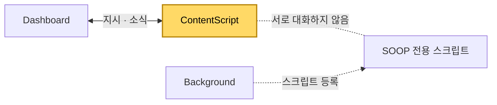

[설계서](../README.md) › [Architecture](Architecture.md) › [Dashboard](Dashboard.md) › ContentScript

# ContentScript

> **다루는 내용:** 방송 화면 안에서 도는 스크립트의 책임과 계약 (입력/트리거/출력)
> **갱신 트리거:** 책임 범위나 입출력 계약이 바뀔 때

## 본문

**책임**
Dashboard가 만든 방송 화면 안에 들어가, 음량 제어·딜레이 측정·넓은 화면 자동 전환·채팅 접기·광고 건너뛰기를 수행한다. SOOP 화면에서는 고화질 연결 안내 팝업 닫기도 함께 처리한다.

**트리거**

| 시점 | 하는 일 |
|---|---|
| 화면이 열릴 때 | 주소에 붙은 표시로 확장 프로그램이 만든 화면인지 판별하고, 아니면 즉시 종료한다 |
| 영상이 나타나거나 재생을 시작할 때 | 음소거를 적용하고 딜레이 측정을 시작하며, 준비 완료를 알리고 넓은 화면 전환을 시도한다 |
| Dashboard의 지시 | 음량 상태를 적용하거나 넓은 화면 전환을 다시 시도한다 |
| 탭이 다시 보이게 됐을 때 | 넓은 화면이 풀려 있으면 다시 시도한다 |

**입력**

| 받는 것 | 어디서 | 내용 |
|---|---|---|
| 지시 | Dashboard | 음량 상태 지정, 넓은 화면 전환 재시도 요청 |
| 주소에 붙은 값 | Dashboard가 만든 주소 | 확장 프로그램이 만든 화면인지, 음소거로 시작할지 |

**출력** (Dashboard로 보내는 소식)

| 소식 | 시점 |
|---|---|
| 준비 완료 | 영상을 처음 확보했을 때. 화면을 다시 불러오면 다시 나간다 |
| 방송 딜레이 | 1초 주기 |
| 현재 음량과 음소거 여부 | 음량이 바뀔 때와 1초 주기 양쪽 |
| 넓은 화면 전환 결과 | 성공 또는 실패로 끝났을 때 |
| 광고 재생 여부 변화 | 광고가 시작되거나 끝날 때 |

**음량 지시의 구성**

음량 지시는 세 값을 **각각 독립적으로** 받는다.

| 값 | 뜻 |
|---|---|
| 음량 크기 | 얼마나 크게 |
| 음소거 여부 | 소리를 낼지 말지 |
| 잠금 여부 | 방송 페이지가 스스로 음소거를 푸는 것을 막을지 |

**다른 모듈과의 관계**

- Dashboard와만 소식을 주고받는다. Background·Popup과는 직접 연결이 없다.
- SOOP 전용 스크립트는 같은 화면 안에서 함께 돌지만 역할이 분리되어 있다. 그 스크립트가 하는 일은 [SOOP](Soop.md) 참고.

**주의**
- ⚠️ 잠금은 **서브 화면에만** 건다. 음량 0과 잠금을 분리해야, 메인 음량이 0이어도 사용자가 직접 풀 수 있다.
- ⚠️ 음량 크기는 **꼭 필요할 때만 지정한다.** 값을 덮어쓰면 방송 페이지가 그것을 채널별 상태로 저장해, 화면을 다시 불러올 때 페이지가 보여주는 상태와 실제 소리가 어긋난다. 음소거만 시킬 때는 크기를 함께 보내지 않는다.
- ⚠️ 음량을 변경 시점에만 보고하면, 방송 페이지가 저장된 음량을 되살리는 시점이 더 빠를 때 그 값을 놓친다. 그래서 주기적으로도 함께 보고한다.
- ⚠️ 화면이 보이지 않는 탭에서는 넓은 화면 전환이 먹지 않을 수 있어, 탭으로 돌아왔을 때 전환되어 있지 않으면 다시 시도한다.
- ⚠️ 딜레이는 영상이 가진 재생 가능 구간을 기준으로 계산하므로, 영상이 없거나 아직 준비되지 않았으면 값이 나오지 않는다.
