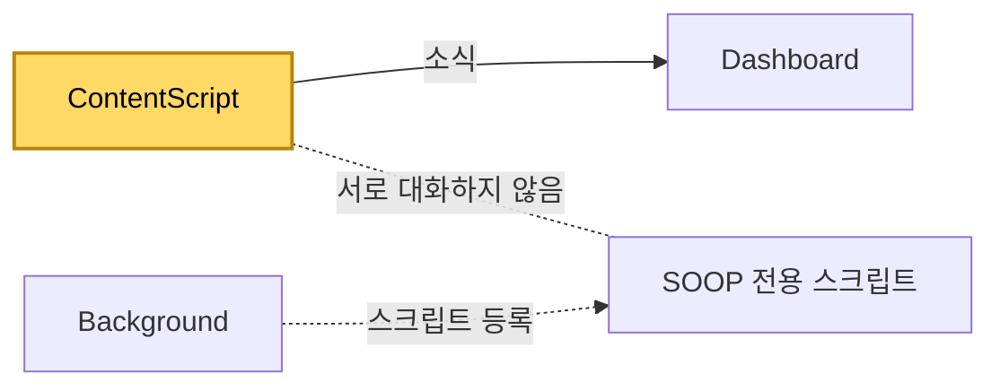

[설계서](../README.md) › [Architecture](Architecture.md) › [Dashboard](Dashboard.md) › ContentScript

# ContentScript

> **다루는 내용:** 방송 화면 안에서 도는 스크립트의 책임과 계약 (입력/트리거/출력)
> **갱신 트리거:** 책임 범위나 입출력 계약이 바뀔 때

## 본문

**책임**
Dashboard가 만든 방송 화면 안에 들어가, 딜레이 측정·넓은 화면 자동 전환·채팅 접기·광고 건너뛰기를 수행한다. SOOP 화면에서는 고화질 연결 안내 팝업 닫기도 함께 처리한다.

**트리거**

| 시점 | 하는 일 |
|---|---|
| 화면이 열릴 때 | 주소에 붙은 표시로 확장 프로그램이 만든 화면인지 판별하고, 아니면 즉시 종료한다 |
| 영상이 나타나거나 재생을 시작할 때 | 음소거를 풀고 딜레이 측정을 시작하며, 넓은 화면 전환을 시도한다 |
| 탭이 다시 보이게 됐을 때 | 넓은 화면이 풀려 있으면 다시 시도한다 |

**입력**

| 받는 것 | 어디서 | 내용 |
|---|---|---|
| 주소에 붙은 값 | Dashboard가 만든 주소 | 확장 프로그램이 만든 화면인지 |

**출력** (Dashboard로 보내는 소식)

| 소식 | 시점 |
|---|---|
| 방송 딜레이 | 1초 주기 |
| 넓은 화면 전환 결과 | 성공 또는 실패로 끝났을 때 |
| 광고 재생 여부 변화 | 광고가 시작되거나 끝날 때 |

**소리에 관해 하는 일**

영상을 처음 잡았을 때 **음소거를 한 번 풀어 주는 것**이 전부다. 그 뒤로는 건드리지 않는다. 크기는 방송 페이지가 채널마다 기억한 값을 그대로 쓴다.

**다른 모듈과의 관계**

- Dashboard에 소식을 **보내기만 한다.** 받는 지시는 없고, Background·Popup과도 직접 연결이 없다.
- SOOP 전용 스크립트는 같은 화면 안에서 함께 돌지만 역할이 분리되어 있다. 그 스크립트가 하는 일은 [SOOP](Soop.md) 참고.

**주의**
- ⚠️ 음량 크기는 **절대 덮어쓰지 않는다.** 값을 지정하면 방송 페이지가 그것을 채널별 상태로 저장해, 다시 불러올 때 페이지가 보여주는 상태와 실제 소리가 어긋난다.
- ⚠️ 화면이 보이지 않는 탭에서는 넓은 화면 전환이 먹지 않을 수 있어, 탭으로 돌아왔을 때 전환되어 있지 않으면 다시 시도한다.
- ⚠️ 딜레이는 영상이 가진 재생 가능 구간을 기준으로 계산하므로, 영상이 없거나 아직 준비되지 않았으면 값이 나오지 않는다.
