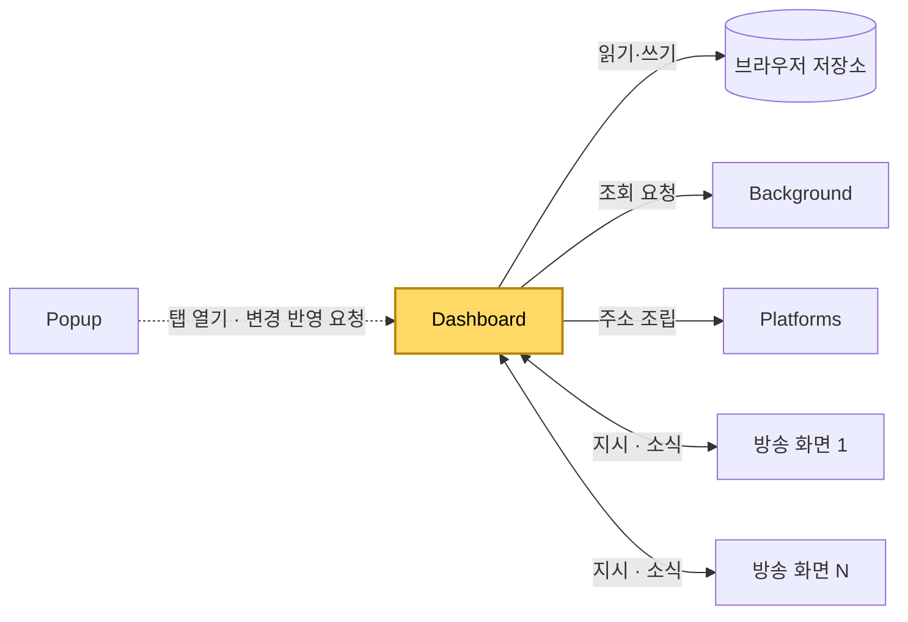
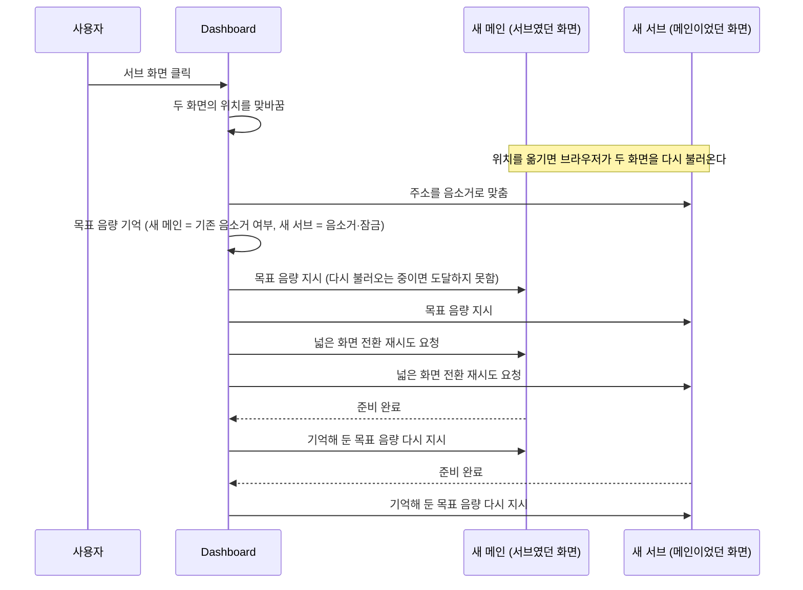
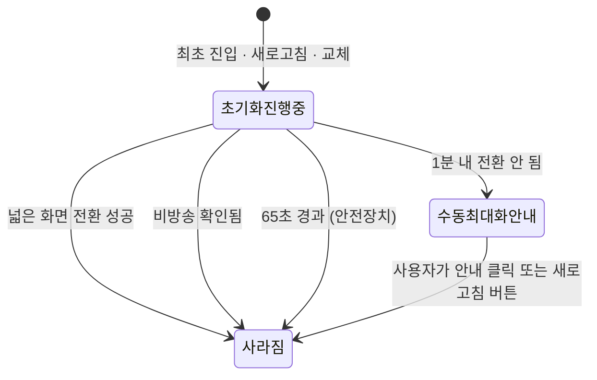

[설계서](../README.md) › [Architecture](Architecture.md) › Dashboard

# Dashboard

> **다루는 내용:** 대시보드의 책임과 계약 (입력/트리거/출력)
> **갱신 트리거:** 책임 범위나 입출력 계약이 바뀔 때

## 하위 문서

| 문서 | 다루는 내용 |
|---|---|
| [ContentScript](ContentScript.md) | 대시보드가 만든 방송 화면 안에서 도는 스크립트 — 책임/계약 |

## 본문

**책임**
멀티뷰 화면 자체. 메인/서브 방송 화면을 만들어 배치하고 교체·자동 동기화·배치·음량·채팅을 총괄한다.

**트리거**

| 시점 | 하는 일 |
|---|---|
| 대시보드 탭이 열릴 때 | 시청 목록과 설정을 읽어 메인·서브 화면을 구성한다 |
| Popup의 변경 반영 요청 | 목록이 달라졌으면 다시 구성하고, 같으면 배치만 되돌린다 |
| 방송 화면의 소식 | 딜레이·음량·전환 결과·광고 상태·준비 완료를 처리한다 |
| 설정 변경 | 자동 동기화와 서브 정보 표시 방식을 새로고침 없이 반영한다 |
| 사용자 조작 | 서브 클릭(교체), 드래그(순서 변경·영역 확대), 버튼(삭제·새로고침·접기) |

**입력**

| 받는 것 | 어디서 | 내용 |
|---|---|---|
| 시청 목록 · 시스템 설정 · 배치 상태 | 브라우저 저장소 | 어떤 채널을 어떤 배치로 띄울지 |
| 조회 결과 | Background | 생방송 상태, 프로필 사진 |
| 소식 | 각 방송 화면 | 딜레이, 음량과 음소거 여부, 넓은 화면 전환 결과, 광고 상태, 준비 완료 |

**출력**

| 내보내는 것 | 받는 쪽 | 내용 |
|---|---|---|
| 주소 조립 요청 | Platforms | 방송 화면 주소, 채팅 주소 |
| 지시 | 각 방송 화면 | 음량 상태 지정, 넓은 화면 전환 재시도 요청 |
| 화면 상태 저장 | 브라우저 저장소 | 채팅 숨김 여부, 서브 영역 접힘·높이 |
| 시청 목록 갱신 | 브라우저 저장소 | 메인↔서브 교체, 서브 순서 변경, 서브 개별 삭제 |
| 조회 요청 | Background | 생방송 상태, 프로필 사진 |

**다른 모듈과의 관계**

- 방송 화면들과 **1:N**으로 소식을 주고받는다. 화면마다 따로 지시하고 따로 보고받는다.
- Platforms는 직접 로드하지만 주소 조립에만 쓴다. 네트워크 호출은 하지 않는다.
- 생방송 상태와 프로필 사진은 Background를 거쳐야만 알 수 있다.

**주의**
- ⚠️ 시청 목록을 저장할 때는 항상 **현재 화면 상태**(메인 + 서브 순서)를 기준으로 쓴다. 저장된 목록의 맨 앞을 메인으로 재사용하면, 교체 직후에는 그 값이 이미 옛 메인이라 목록이 깨진다.

### 메인 ↔ 서브 교체

**주의**
- ⚠️ 화면을 옮기면 브라우저가 그 안의 내용을 **다시 불러온다.** 그래서 옮긴 직후 보낸 지시는 사라질 수 있고, 다시 불러온 화면은 주소에 적힌 음소거 여부로 초기화된다. 목표 음량을 기억해 두었다가 준비 완료 소식을 받을 때마다 다시 보내는 이유다.
- ⚠️ 다시 불러오면 넓은 화면 상태도 풀리므로 양쪽 모두 전환을 다시 요청한다.
- ⚠️ 새 메인은 **음소거로 불러온 뒤 해제**한다. 소리가 켜진 주소로 불러오면 브라우저의 자동 재생 차단에 걸려 영상이 시작되지 않을 수 있다.
- ⚠️ 초기화 안내가 떠 있는 동안에는 교체가 막힌다.

### 초기화 안내 상태 전이

**주의**
- ⚠️ "초기화 진행중"인 동안에는 메인↔서브 교체가 동작하지 않는다.
- ⚠️ "수동 최대화 필요" 안내에는 자동 소멸이 없다. 사용자가 닫아야 사라진다.

### 자동 동기화 · 비방송 확인

정해진 주기로 화면 상태를 확인하고 필요하면 해당 화면만 새로고침한다.

| 확인하는 것 | 주기 | 새로고침 조건 |
|---|---|---|
| 방송 딜레이 | 방송 화면이 1초마다 보고 | 설정한 기준 시간을 넘으면. 같은 화면은 15초 안에 다시 새로고침하지 않는다 |
| 영상 신호 | 5초마다 확인 | 마지막 신호로부터 10초가 지나면 |
| 생방송 여부 | 1분마다 Background에 조회 | 새로고침 대신 "방송중이 아닙니다" 표시를 켜고 끈다 |

**주의**
- ⚠️ **광고 재생 중인 화면과 비방송 상태인 화면은 새로고침 판정에서 빠진다.** 광고 중에는 무신호 판정의 기준 시각을 계속 현재로 갱신해, 광고가 끝날 때까지 무신호로 보지 않는다.
