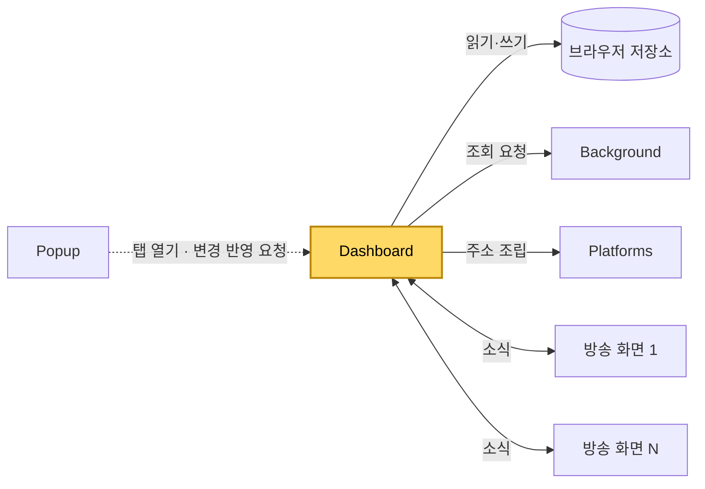
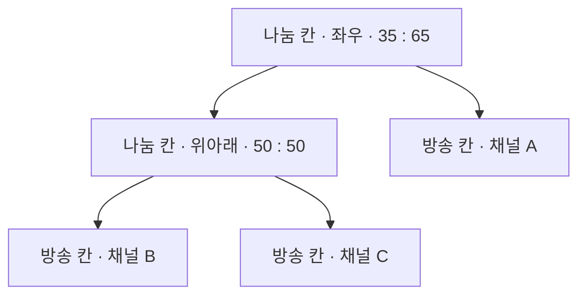
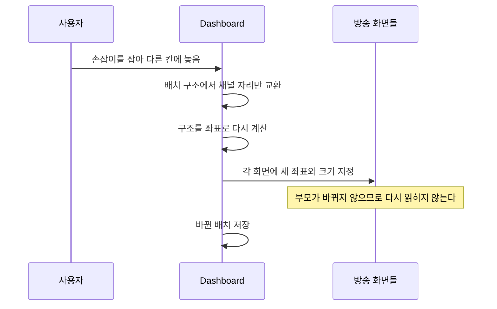
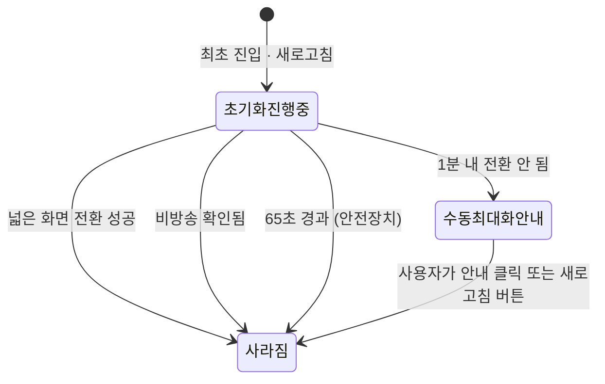

[설계서](../README.md) › [Architecture](Architecture.md) › Dashboard

# Dashboard

> **다루는 내용:** 대시보드의 책임과 계약 (입력/트리거/출력)
> **갱신 트리거:** 책임 범위나 입출력 계약이 바뀔 때

## 하위 문서

| 문서 | 다루는 내용 |
|---|---|
| [ContentScript](ContentScript.md) | 대시보드가 만든 방송 화면 안에서 도는 스크립트 — 책임/계약 |

## 본문

**책임**
멀티뷰 화면 자체. 채널마다 방송 화면을 하나씩 만들어 칸에 배치하고, 배치·크기 조절·자리 옮기기·자동 동기화를 총괄한다.

**트리거**

| 시점 | 하는 일 |
|---|---|
| 대시보드 탭이 열릴 때 | 시청 목록과 설정을 읽어 방송 화면을 만들고 저장된 배치에 맞춰 놓는다 |
| Popup의 변경 반영 요청 | 담긴 채널이 달라졌으면 다시 구성하고, 같으면 아무것도 하지 않는다 |
| 창 크기 변경 | 비율은 그대로 두고 좌표만 다시 계산한다 |
| 방송 화면의 소식 | 딜레이·전환 결과·광고 상태를 처리한다 |
| 설정 변경 | 자동 동기화와 채널 표시 방식을 새로고침 없이 반영한다 |
| 사용자 조작 | 경계 드래그(크기), 손잡이 드래그(자리·쪼개기), 버튼(닫기·새로고침·확대) |

**입력**

| 받는 것 | 어디서 | 내용 |
|---|---|---|
| 시청 목록 · 시스템 설정 · 저장된 배치 | 브라우저 저장소 | 어떤 채널을 어떤 모양으로 띄울지 |
| 조회 결과 | Background | 생방송 상태, 프로필 사진 |
| 소식 | 각 방송 화면 | 딜레이, 넓은 화면 전환 결과, 광고 상태 |

**출력**

| 내보내는 것 | 받는 쪽 | 내용 |
|---|---|---|
| 주소 조립 요청 | Platforms | 방송 화면 주소 |
| 배치 저장 | 브라우저 저장소 | 칸 구조와 비율 |
| 시청 목록 갱신 | 브라우저 저장소 | 칸을 닫아 채널을 뺐을 때 |
| 조회 요청 | Background | 생방송 상태, 프로필 사진 |

**다른 모듈과의 관계**

- 방송 화면들과 **1:N**으로 소식을 주고받는다. 화면마다 따로 보고받는다.
- Platforms는 직접 로드하지만 주소 조립에만 쓴다. 네트워크 호출은 하지 않는다.
- 생방송 상태와 프로필 사진은 Background를 거쳐야만 알 수 있다.
- **음량은 다루지 않는다.** 각 칸이 방송 페이지를 그대로 띄우고 있으므로 그 페이지의 조절 기능과 기억값에 맡긴다.

### 배치를 다루는 방식

배치는 칸을 재귀적으로 쪼갠 구조로 기억한다. 칸은 두 종류다.

- **나눔 칸** — 안을 가로 또는 세로로 갈라 여러 칸을 품는다. 가르는 방향과 자식들의 비율을 가진다.
- **방송 칸** — 채널 하나를 담는 끝단이다.

이 구조를 화면 크기와 곱하면 각 칸이 놓일 자리와 칸 사이 경계 위치가 나온다. 비율만 저장하므로 창 크기가 달라져도 같은 모양이 나온다.

| 조작 | 구조에 일어나는 일 |
|---|---|
| 경계 드래그 | 경계 양쪽 두 칸의 비율만 주고받는다. 나머지 칸은 그대로다 |
| 자리 바꾸기 | 두 방송 칸이 담은 채널만 맞바꾼다. 구조는 그대로다 |
| 쪼개서 넣기 | 옮길 채널을 먼저 빼고(형제가 자리를 흡수), 목적지 칸을 둘로 갈라 넣는다 |
| 칸 닫기 | 그 칸을 빼고 형제가 자리를 흡수한다 |

**주의**
- ⚠️ 저장된 배치와 시청 목록은 어긋날 수 있다. 화면을 구성하기 전에 **목록에 없는 채널의 칸을 없애고, 칸이 없는 채널을 가장 넓은 칸에 쪼개 넣어** 둘을 맞춘다.
- ⚠️ 저장된 배치가 깨져 있으면 그대로 쓰지 않고 자동 배치로 되돌린다.

### 방송 화면을 옮기지 않는 이유

방송 화면을 화면 구조상 **다른 부모 밑으로 옮기면** 브라우저가 그 안의 내용을 버리고 처음부터 다시 읽는다. 그래서 방송 화면은 한 번 놓은 뒤 **자리와 크기만 바꾼다.** 자리 바꾸기도 배치 구조에서 채널 이름만 맞바꿀 뿐 화면 자체는 옮기지 않는다.

**주의**
- ⚠️ 이 규칙이 깨지면 자리를 바꿀 때마다 영상이 끊기고, 음소거·넓은 화면 상태도 함께 풀린다. 배치를 손볼 때 **방송 화면의 부모를 바꾸지 않는지** 반드시 확인한다.

### 초기화 안내 상태 전이

**주의**
- ⚠️ "수동 최대화 필요" 안내에는 자동 소멸이 없다. 사용자가 닫아야 사라진다.

### 자동 동기화 · 비방송 확인

정해진 주기로 화면 상태를 확인하고 필요하면 해당 칸만 새로고침한다.

| 확인하는 것 | 주기 | 새로고침 조건 |
|---|---|---|
| 방송 딜레이 | 방송 화면이 1초마다 보고 | 설정한 기준 시간을 넘으면. 같은 칸은 15초 안에 다시 새로고침하지 않는다 |
| 영상 신호 | 5초마다 확인 | 마지막 신호로부터 10초가 지나면 |
| 생방송 여부 | 1분마다 Background에 조회 | 새로고침 대신 "방송중이 아닙니다" 표시를 켜고 끈다 |

**주의**
- ⚠️ **광고 재생 중인 칸과 비방송 상태인 칸은 새로고침 판정에서 빠진다.** 광고 중에는 무신호 판정의 기준 시각을 계속 현재로 갱신해, 광고가 끝날 때까지 무신호로 보지 않는다.
