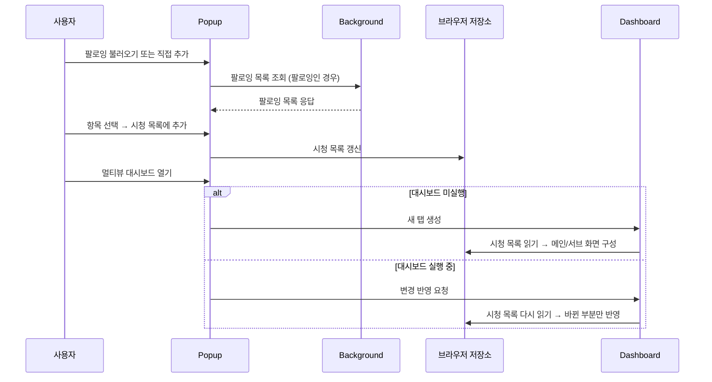
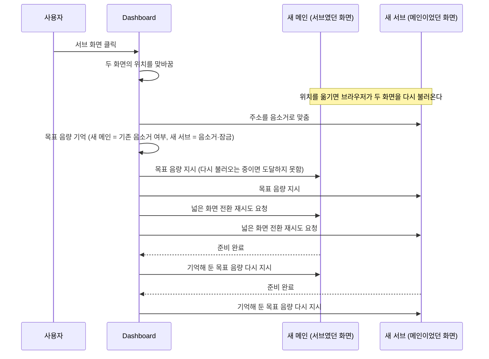
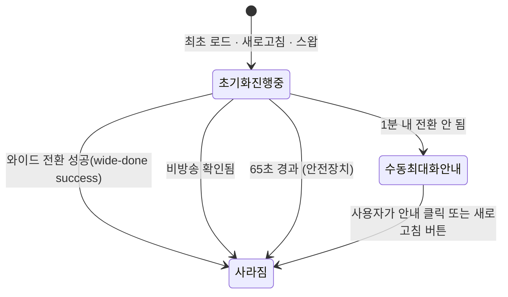

[설계서](../README.md) › [Overview](Overview.md) › Flows

# Flows

> **다루는 내용:** 주요 동작 흐름 (스트리머 추가 → 시청 시작, 메인↔서브 스왑, 자동 동기화 등)
> **갱신 트리거:** 흐름의 단계나 순서가 바뀔 때

## 본문

### 스트리머 추가 → 시청 시작

### 메인 ↔ 서브 교체

**주의**
- ⚠️ 화면을 옮기면 브라우저가 그 안의 내용을 **다시 불러온다.** 그래서 옮긴 직후 보낸 지시는 사라질 수 있고, 다시 불러온 화면은 주소에 적힌 음소거 여부로 초기화된다. 목표 음량을 기억해 두었다가 준비 완료 소식을 받을 때마다 다시 보내는 이유다.
- ⚠️ 다시 불러오면 넓은 화면 상태도 풀리므로 양쪽 모두 전환을 다시 요청한다.
- ⚠️ 새 메인을 소리가 켜진 주소로 불러오면 브라우저의 자동 재생 차단에 걸릴 수 있어, 음소거로 불러온 뒤 준비 완료 시점에 해제한다.

### 초기화 안내 상태 전이

- ⚠️ "초기화 진행중" 상태인 동안에는 메인↔서브 스왑이 동작하지 않는다.

### 자동 동기화 / 비방송 확인 (반복 주기)

- 딜레이 측정: Content Script가 1초마다 딜레이를 Dashboard로 보고 → 기준치 초과 시 새로고침(쿨다운 15초)
- 무신호 감지: Dashboard가 5초마다 확인, 마지막 신호로부터 10초 이상 지나면 해당 화면만 새로고침
- 비방송 재확인: Dashboard가 1분마다 Background에 생방송 상태를 물어 화면별로 "방송중이 아닙니다" 표시/해제

**주의**
- ⚠️ 위 새로고침 판정에서 **광고 재생 중인 화면과 비방송 상태인 화면은 제외**된다. 광고 중에는 무신호 판정의 기준 시각을 계속 현재로 갱신해, 광고가 끝날 때까지 무신호로 간주하지 않는다.
