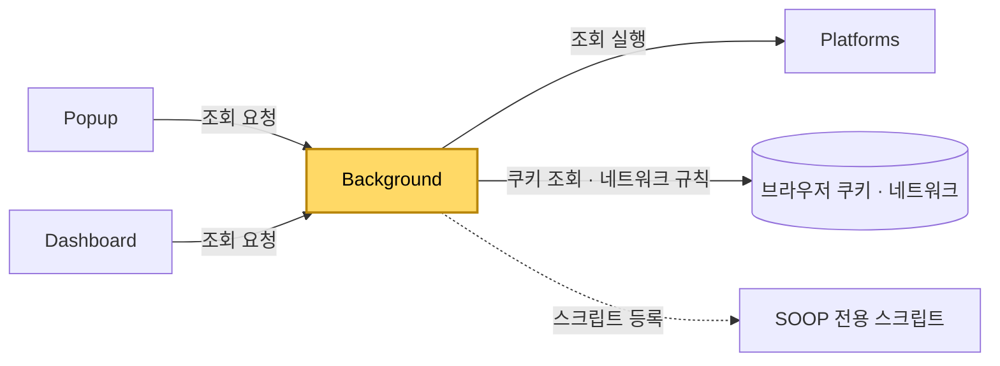

[설계서](../../../README.md) › [구현](../README.md) › [모듈](README.md) › Background

# Background

> **다루는 내용:** 서비스 워커 모듈의 책임과 입출력, 네트워크 규칙을 어떻게 거는지
> **갱신 트리거:** 책임 범위나 입출력, 거는 규칙이 바뀔 때

## 본문

**책임**
인증·네트워크 대리 모듈. 로그인 쿠키를 방송 화면과 조회 요청에 싣는 규칙, 끼워 넣기 제한을 걷어 내는 규칙을 걸고, Popup·Dashboard를 대신해 외부 조회를 수행한다. SOOP 전용 스크립트를 등록한다.

**트리거**

| 시점 | 하는 일 |
|---|---|
| 확장 설치·업데이트 (`runtime.onInstalled`) | 예전 규칙 정리, 끼워 넣기 제한 해제 규칙, 쿠키 싣기 규칙, SOOP 전용 스크립트 등록 |
| 브라우저 시작 (`runtime.onStartup`) | 예전 규칙 정리, 끼워 넣기 제한 해제 규칙, 쿠키 싣기 규칙 |
| 네이버·SOOP 쿠키 변경 (`cookies.onChanged`) | 쿠키 싣기 규칙을 새 값으로 다시 건다 |
| Popup·Dashboard의 메시지 | SOOP 로그인 확인 · 팔로잉 목록 · 생방송 상태·프로필 사진 조회 |

**입력**

| 받는 것 | 어디서 | 내용 |
|---|---|---|
| 조회 요청 | Popup · Dashboard | 무엇을 조회할지, 어느 플랫폼의 어느 채널인지 |
| 로그인 쿠키 | 브라우저 | 모으는 범위는 플랫폼마다 다르다 — [치지직](../../Requirements/External-Interfaces/Chzzk.md#13-로그인-판단과-인증-쿠키) · [SOOP](../../Requirements/External-Interfaces/Soop.md#13-로그인-판단과-인증-쿠키) |

**출력**

| 내보내는 것 | 받는 쪽 | 내용 |
|---|---|---|
| 쿠키 싣기 규칙 | 브라우저 (`declarativeNetRequest` 동적 규칙) | 요청 헤더의 쿠키를 모은 로그인 쿠키로 바꾼다 |
| 끼워 넣기 제한 해제 규칙 | 브라우저 (같은 장치) | 응답 헤더 `Content-Security-Policy`를 지운다 |
| 조회 응답 | Popup · Dashboard | 성공 여부와 결과 / 생방송 여부와 프로필 사진 주소 / 로그인 여부 |
| SOOP 전용 스크립트 등록 | 브라우저 (`scripting.registerContentScripts`) | MAIN 월드에 등록 — [ContentScript](ContentScript.md#soop-전용-스크립트) |

### 거는 규칙

| 규칙 | 걸리는 요청 | 하는 일 | 걸리는 때 |
|---|---|---|---|
| 치지직 방송 화면 쿠키 | `chzzk.naver.com` · `sub_frame` | 쿠키를 치지직 인증 쿠키 3개로 바꿈 | 치지직 쿠키가 있을 때만 |
| 치지직 조회 쿠키 | `api.chzzk.naver.com` · `xmlhttprequest` · `other` | 위와 같음 | 치지직 쿠키가 있을 때만 |
| SOOP 방송 화면 쿠키 | `play.sooplive.com` · `sub_frame` | 쿠키를 두 도메인 쿠키를 모은 값으로 바꿈 | SOOP 쿠키가 있을 때만 |
| 치지직 끼워 넣기 제한 해제 | `chzzk.naver.com` · `sub_frame` · **요청을 시작한 곳이 이 확장** | 응답 헤더 `Content-Security-Policy` 지움 | **늘** |

- 끼워 넣기 제한 해제는 세 조건(칸으로 띄운 화면 · 치지직 주소 · 이 확장이 연 것)을 모두 걸어야 한다. 요구사항은 [품질 속성 — 보안](../../Requirements/Quality-Attributes.md#2-보안). "이 확장이 연 것"은 요청 시작 도메인 조건에 확장 고유 식별값을 넣어 고른다.[^1]
- 쿠키 싣기와 끼워 넣기 제한 해제를 **한 규칙으로 묶지 않는다.** 쿠키 싣기는 쿠키가 있을 때만 걸리므로, 묶으면 로그아웃 상태에서 방송 화면 자체가 막힌다.
- 두 규칙은 같은 요청에 함께 걸린다. 하나는 요청 헤더, 하나는 응답 헤더를 고치므로 서로 덮어쓰지 않는다.
- 동적 규칙은 브라우저를 껐다 켜도 남는다. 시작 때 다시 거는 것은 쿠키 값을 새로 반영하려는 것이다.

**주의**
- ⚠️ 제한이 실린 헤더는 **통째로** 지운다. 확인일 기준 그 헤더에는 끼워 넣기 제한 하나만 실려 있어 다른 보호가 함께 사라지지 않는다. 같은 헤더에 다른 규칙이 실리기 시작하면 다시 판단한다.[^2]
- ⚠️ 규칙 번호는 쿠키 규칙과 겹치지 않게 따로 둔다. 쿠키 규칙을 다시 걸 때 쿠키 규칙 번호들을 지우고 거는데, 거기 섞이면 해제 규칙까지 지워진다.
- ⚠️ 코드를 고친 뒤 확장을 새로고침하지 않으면 설치·업데이트 처리가 돌지 않아 새 규칙이 걸리지 않는다 — [확인과 진단](../Build-Deploy.md#확인과-진단)

**다른 모듈과의 관계**

- Platforms 어댑터를 직접 로드해서 쓴다. 조회 내용 자체는 Platforms 책임이다.
- Popup·Dashboard는 팔로잉 목록·생방송 상태를 이 모듈을 거쳐서만 얻는다.

[^1]: 크롬 확장 개발 지원팀(Chrome Extensions DevRel)이 확장 페이지 안에 띄운 화면의 헤더를 지울 때 권장한 조건 조합이다 — 칸 화면(`sub_frame`) · 요청 도메인 · 요청 시작 도메인에 확장 식별값. 2026-10-07 실제 대시보드에서 규칙이 이 요청에 걸리는 것을 확인했다.
[^2]: 탈락한 대안 — 헤더 값의 일부만 고쳐 쓰기. 고쳐 쓸 값을 우리가 미리 정해 두어야 해서, 치지직이 허용 목록이나 다른 규칙을 바꾸면 우리 값이 낡은 채로 덮어쓰게 된다.
