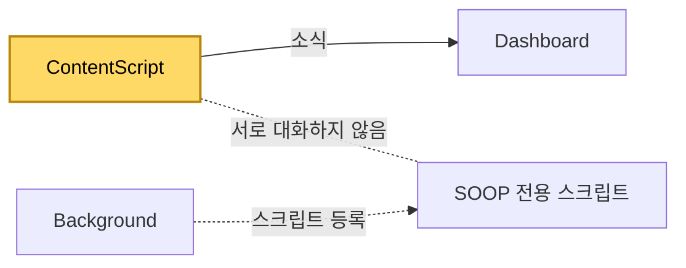

[설계서](../../../README.md) › [구현](../README.md) › [모듈](README.md) › ContentScript

# ContentScript

> **다루는 내용:** 방송 화면 안에서 도는 스크립트의 책임과 입출력
> **갱신 트리거:** 책임 범위나 입출력, 방송 화면 안에서 하는 일이 바뀔 때

## 본문

**책임**
Dashboard가 만든 방송 화면 안에 들어가 딜레이 측정 · 넓은 화면 전환 · 채팅 접기 · 광고 건너뛰기를 한다. SOOP 화면에서는 고화질 연결 안내 창도 닫는다. 화면 요소를 찾는 방법은 플랫폼이 정한 것이라 [치지직](../../Requirements/External-Interfaces/Chzzk.md#2-화면-요소) · [SOOP](../../Requirements/External-Interfaces/Soop.md#3-화면-요소)에 있다.

**어디에 붙나**
설정 파일의 콘텐츠 스크립트 선언으로 치지직·SOOP 방송 주소의 **모든 프레임**에 브라우저가 붙인다. Dashboard가 넣는 것이 아니다.

**트리거**

| 시점 | 하는 일 |
|---|---|
| 화면이 열릴 때 | 주소에 확장이 붙인 표시가 있는지 본다. 없으면 바로 손을 뗀다 |
| 영상이 나타날 때 | 음소거를 한 번 푼다. 처음 15초 동안은 화면 변화를 지켜보며 새 영상·채팅·안내 창을 찾는다 |
| 영상이 실제로 재생을 시작할 때 | 딜레이 측정을 시작하고, 2초 뒤 넓은 화면 전환을 시도한다 |
| 탭이 다시 보이게 됐을 때 | 넓은 화면이 풀려 있으면 다시 시도한다 |
| 0.5초마다 | 광고 건너뛰기 버튼이 있으면 누른다 |

**출력** (Dashboard로 보내는 창 사이 메시지)

| 소식 | 시점 |
|---|---|
| 방송 딜레이 | 재생이 시작된 뒤부터 1초마다 |
| 넓은 화면 전환 결과 | 성공 또는 실패(0.3초마다 60번 시도 후)로 끝났을 때 |
| 광고 재생 여부 | 광고가 시작되거나 끝날 때 |

- 딜레이 = 영상의 재생 가능 구간 끝 − 지금 재생 위치. 재생 전에 재지 않는 까닭은 [자동 동기화](../../Requirements/Functions/Multiview/Automation.md#3-자동-동기화) 참고.
- 이 소식은 Dashboard에서 **영상 신호가 살아 있다는 표시로도** 쓰인다 — [Dashboard](Dashboard.md#2-자동-동기화)

**다른 모듈과의 관계**

- Dashboard에 소식을 **보내기만 한다.** 받는 지시는 없고, Background·Popup과도 직접 연결이 없다.

**주의**
- ⚠️ 음량 크기는 **절대 덮어쓰지 않는다.** 값을 지정하면 방송 페이지가 그것을 채널별 상태로 저장해, 다시 불러올 때 페이지가 보여주는 크기와 실제 소리가 어긋난다.
- ⚠️ 넓은 화면 버튼은 누를 때마다 켜고 끄는 버튼이다. 이미 넓은 화면이면 누르지 않는다.
- ⚠️ 넓은 화면 전환은 0.3초마다 60번, **약 18초** 시도한다. 예전 명세와 코드 주석은 "1분"이라 적고 있었으나 실제 동작에 맞춰 명세를 고쳤다(2026-10-07). Dashboard의 "초기화 진행중" 안내 안전장치(65초)는 실패 소식이 끝내 오지 않을 때만 쓰인다.

### SOOP 전용 스크립트

SOOP 고화질 재생기가 내 컴퓨터 주소로 보내는 요청을 **실패시켜** 일반 재생으로 넘어가게 한다 — 그 동작은 [SOOP](../../Requirements/External-Interfaces/Soop.md#21-고화질-재생기).

- 방송 페이지 자체의 코드를 가로채야 하므로 확장 전용 영역(격리 월드)이 아니라 **페이지와 같은 실행 영역(MAIN 월드)**에서 돈다.
- 설정 파일의 선언으로는 MAIN 월드 실행이 보장되지 않아, Background가 설치·업데이트 때 스크립트 등록 기능으로 등록한다. 등록은 브라우저를 껐다 켜도 남는다.
- 위 ContentScript와 같은 화면에서 돌지만 서로 대화하지 않는다.
