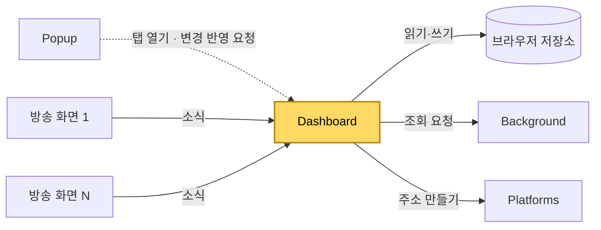
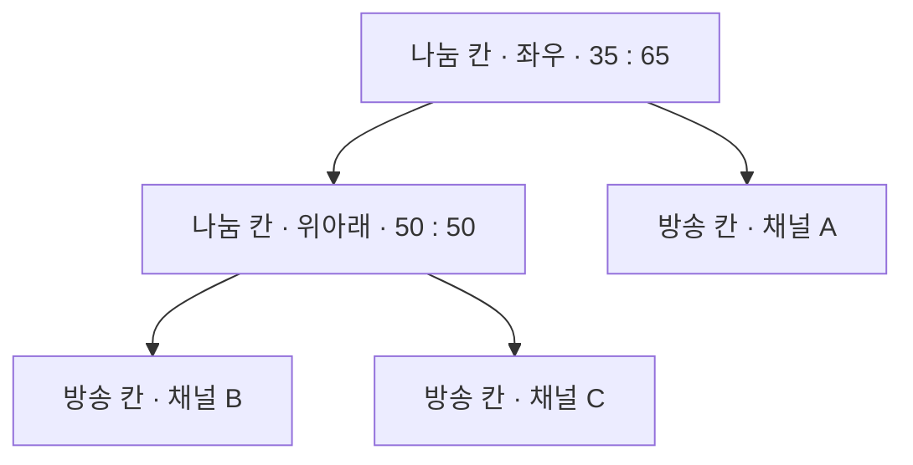
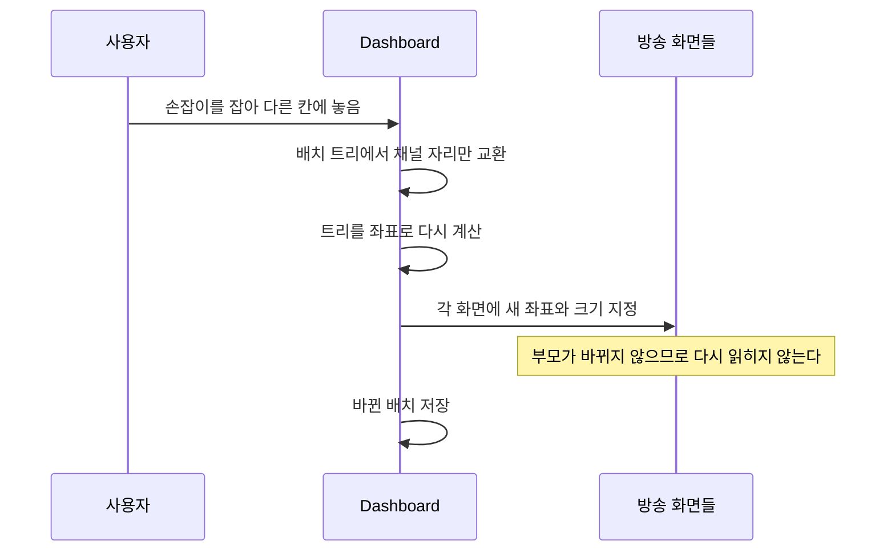

[설계서](../../../README.md) › [구현](../README.md) › [모듈](README.md) › Dashboard

# Dashboard

> **다루는 내용:** 대시보드 모듈의 책임과 입출력, 배치·방송 화면·자동 동기화를 어떻게 다루는지
> **갱신 트리거:** 책임 범위나 입출력, 배치·자동 동기화를 다루는 방식이 바뀔 때

## 본문

**책임**
채널마다 방송 화면(iframe)을 하나씩 만들어 칸에 놓고, 배치·크기 조절·자리 옮기기·자동 동기화를 총괄한다.

**트리거**

| 시점 | 하는 일 |
|---|---|
| 대시보드 탭이 열릴 때 | 시청 목록·설정·배치를 읽어 방송 화면을 만들고 배치에 맞춰 놓는다 |
| Popup의 변경 반영 요청 | 담긴 채널 집합을 비교해, 다르면 전부 다시 만들고 같으면 아무것도 하지 않는다 |
| 창 크기 변경 | 비율은 그대로 두고 좌표만 다시 계산한다 |
| 방송 화면의 소식 | 딜레이·넓은 화면 전환 결과·광고 상태를 처리한다 |
| 저장소의 설정 변경 | 자동 동기화와 채널 표시 방식을 새로고침 없이 반영한다 |
| 사용자 조작 | 경계 드래그(크기), 손잡이 드래그(자리·쪼개기), 버튼(닫기·새로고침·확대) |

**입력**

| 받는 것 | 어디서 | 내용 |
|---|---|---|
| 시청 목록 · 설정 · 배치 | 브라우저 저장소 | 어떤 채널을 어떤 모양으로 띄울지 |
| 조회 결과 | Background | 생방송 여부, 프로필 사진 |
| 소식 | 각 방송 화면 | 딜레이, 넓은 화면 전환 결과, 광고 상태 |

**출력**

| 내보내는 것 | 받는 쪽 | 내용 |
|---|---|---|
| 방송 주소 요청 | Platforms | 채널의 방송 화면 주소 (네트워크 없음) |
| 배치 저장 | 브라우저 저장소 | 배치 트리 |
| 시청 목록 갱신 | 브라우저 저장소 | 칸을 닫아 채널을 뺐을 때 |
| 조회 요청 | Background | 생방송 여부, 프로필 사진 |

**다른 모듈과의 관계**

- 방송 화면들이 각자 소식을 보낸다. 어느 칸에서 온 소식인지는 보낸 창으로 가린다.
- **음량은 다루지 않는다.**

### 1. 배치

배치는 나눔 칸과 방송 칸으로 된 트리 하나다 — 모양은 [데이터](../../Requirements/Data.md#5-대시보드-배치). 이 트리를 화면 크기와 곱해 칸 좌표와 경계 위치를 얻는다.

| 조작 | 트리에 일어나는 일 |
|---|---|
| 경계 드래그 | 경계 양쪽 두 칸의 비율만 주고받는다 |
| 자리 바꾸기 | 두 방송 칸이 담은 채널만 맞바꾼다. 구조는 그대로다 |
| 쪼개서 넣기 | 옮길 채널을 먼저 빼고(형제가 자리를 흡수), 목적지 칸을 둘로 갈라 넣는다 |
| 칸 닫기 | 그 칸을 빼고 형제가 자리를 흡수한다 |
| 목록과 맞추기 | 목록에 없는 채널의 칸을 빼고, 칸이 없는 채널을 가장 넓은 칸에 쪼개 넣는다 |

#### 1.1 방송 화면을 옮기지 않는다

방송 화면(iframe)을 화면 구조상 **다른 부모 밑으로 옮기면** 브라우저가 그 안의 내용을 버리고 처음부터 다시 읽는다. 그래서 방송 화면은 한 번 놓은 뒤 **자리와 크기만 바꾼다.**

**주의**
- ⚠️ 이 규칙이 깨지면 자리를 바꿀 때마다 영상이 끊기고, 넓은 화면 상태도 풀린다. 배치를 손볼 때 **방송 화면의 부모를 바꾸지 않는지** 반드시 확인한다.

#### 1.2 좁은 칸 축소

칸이 플랫폼별 기준 폭보다 좁으면, 방송 화면을 기준 폭으로 그린 뒤 CSS 변형(`transform: scale`)으로 칸에 맞게 줄인다. 높이는 칸의 가로세로 비율을 따른다.

| 플랫폼 | 기준 폭 | 근거 |
|---|---|---|
| SOOP | 640px | 관측값 |
| 치지직 | **960px** | 잰 최소 폭 950px([치지직](../../Requirements/External-Interfaces/Chzzk.md#14-좁은-칸에서-생기는-스크롤-막대))보다 조금 높였다[^1] |

- 영역 확대와 **같은 변형을 함께 쓴다.** 확대 중에는 확대가 이기고, 풀면 축소로 돌아온다. 한쪽만 따로 적용하면 서로 덮어써서 화면이 어긋난다.
- 확대할 영역은 **눈에 보이는 화면 기준**으로 고르므로, 줄어든 만큼을 되돌려 페이지 좌표로 바꿔 기억한다.

### 2. 자동 동기화

| 확인하는 것 | 주기 | 다시 읽는 조건 |
|---|---|---|
| 방송 딜레이 | 방송 화면이 1초마다 보냄 | 허용 지연 시간 이상. 같은 칸은 15초 안에 다시 읽지 않는다 |
| 영상 신호 | 5초마다 확인 | 마지막 딜레이 소식으로부터 10초 경과 |
| 생방송 여부 | 1분마다 Background에 조회 | 다시 읽지 않고 "방송중이 아닙니다"를 켜고 끈다. 꺼진 칸은 방송 화면 주소를 비운다 |

- 광고 중인 칸과 방송이 꺼진 칸은 판정에서 뺀다. 광고 중에는 무신호 기준 시각을 계속 지금으로 당겨 둔다.
- 다시 읽기는 방송 화면 주소를 다시 넣는 것이다.

### 3. 화면 안내

| 안내 | 띄우는 때 | 지우는 때 |
|---|---|---|
| 초기화 진행중 | 칸을 만들 때 | 넓은 화면 전환 성공 소식, 방송 꺼짐 확인, 또는 65초 뒤 안전장치 |
| 수동 최대화 필요 | 넓은 화면 전환 실패 소식 | 사용자가 누르거나 새로고침 버튼 |

[^1]: 잰 값 그대로면 폭 1920인 화면을 좌우로 나눈 칸(약 955px)이 기준 바로 위로 빠져, 그 칸만 줄이지 않고 그리는 바람에 옆 칸과 배치가 어긋나 보였다. 960이면 이 경우는 해결되지만, 960보다 넓은 칸은 여전히 줄이지 않으므로 큰 화면에서는 같은 어긋남이 남는다 — [좁은 칸 축소](../../Requirements/Functions/Multiview/Stream-Cell.md#3-좁은-칸-축소)
