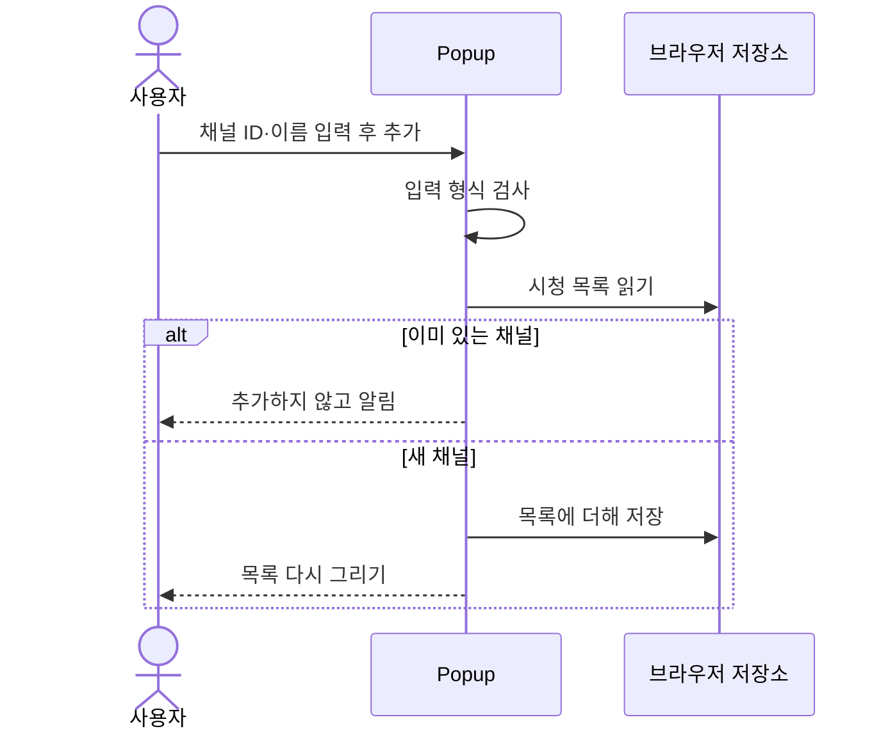
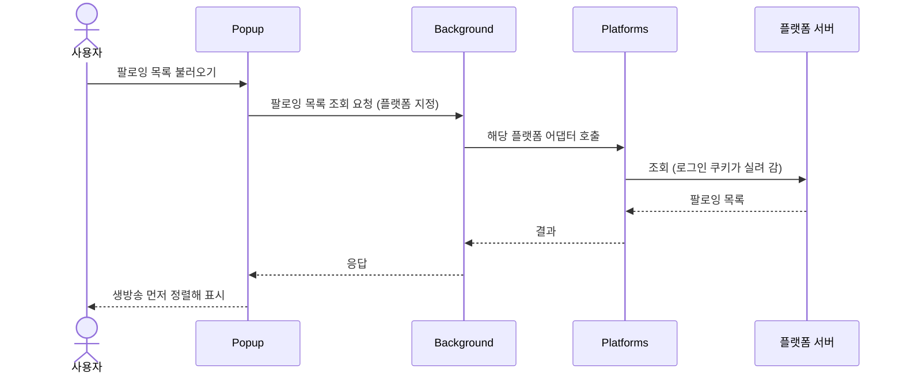
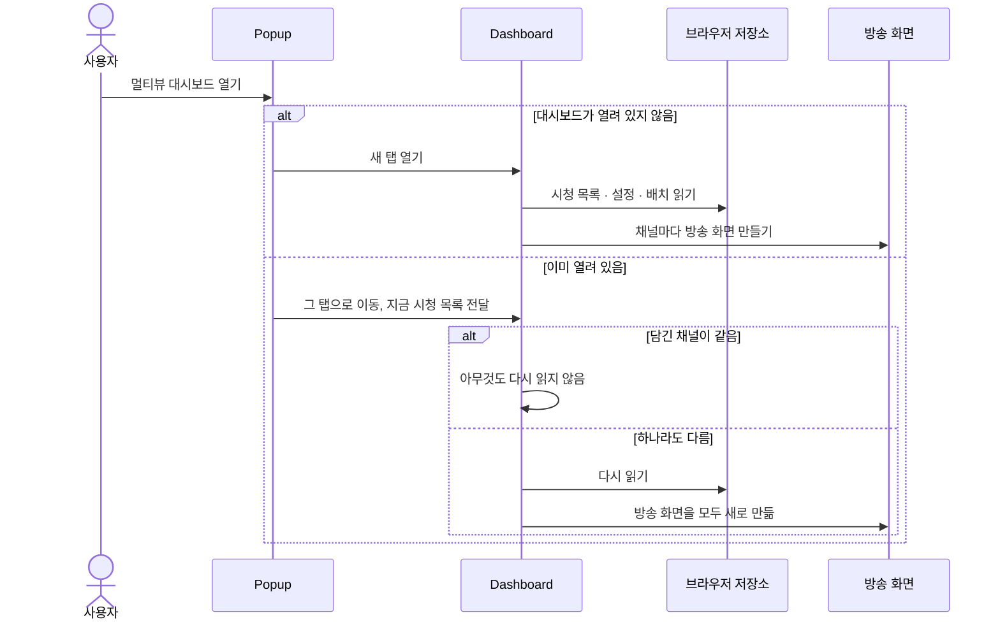
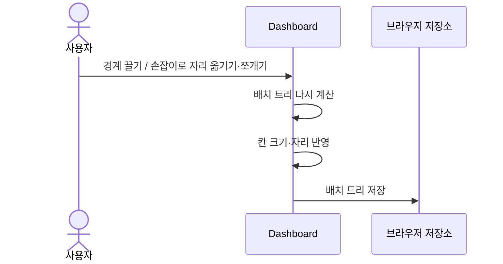
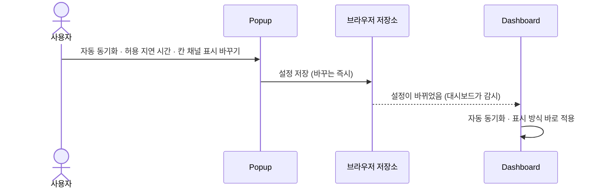
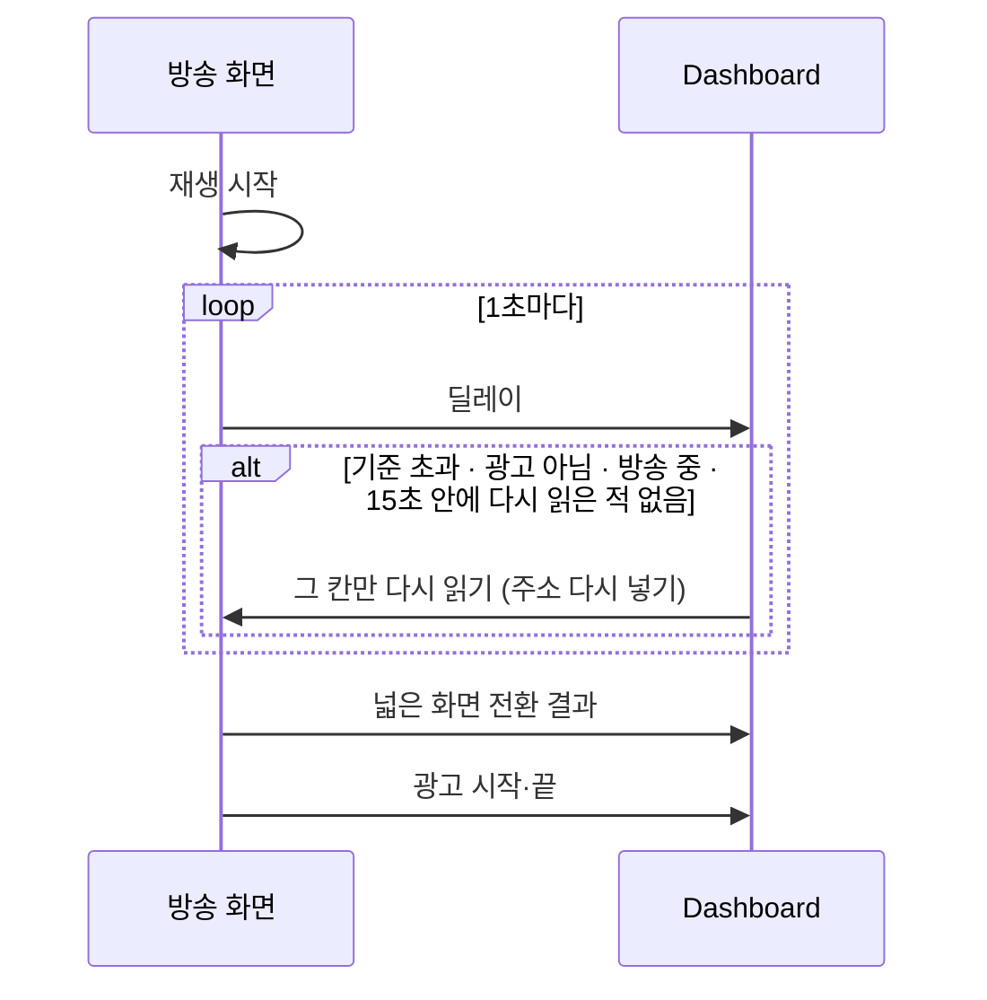

[설계서](../../../README.md) › [구현](../README.md) › [모듈](README.md) › 조작 흐름

# 사용자 조작 흐름

> **다루는 내용:** 사용자가 조작했을 때 모듈들이 주고받는 순서
> **갱신 트리거:** 조작에 따라 모듈 사이에 오가는 순서가 바뀔 때

## 본문

### 1. 채널 추가

- 열려 있는 대시보드에는 **알리지 않는다.** 반영은 `멀티뷰 대시보드 열기`를 누를 때 한꺼번에 한다 — [3. 대시보드 열기](#3-대시보드-열기)
- 즐겨찾기에서 옮기기, 팔로잉 목록에서 더하기, 저장한 목록 불러오기, 받은 글로 덮어쓰기도 같다. 저장소에만 쓴다.

### 2. 팔로잉 목록 불러오기

- 버튼을 보여 줄지 정하는 **로그인 판단**은 플랫폼마다 다르다. 치지직은 팝업이 브라우저 쿠키를 직접 보고, SOOP은 Background에 확인을 맡긴다 — [치지직](../../Requirements/External-Interfaces/Chzzk.md) · [SOOP](../../Requirements/External-Interfaces/Soop.md)
- 조회가 실패하면 실패 안내와 함께 그 플랫폼 홈으로 가는 링크를 보여 준다.

### 3. 대시보드 열기

- 담긴 채널이 하나라도 다르면 겹치는 채널까지 **모두 다시 읽는다.** 그 순간 보던 방송이 끊긴다.
- 방송 화면 안 스크립트는 브라우저가 붙여 준다. 대시보드가 따로 넣거나 초기화 지시를 보내지 않는다.

### 4. 배치 바꾸기

- 방송 화면을 다시 만들지 않는다. 칸의 크기와 위치만 바뀌므로 보던 방송이 끊기지 않는다.
- 저장하는 모양은 [저장 데이터](../../Requirements/Data.md#5-대시보드-배치) 참고.

### 5. 설정 바꾸기

- 팝업이 대시보드에 알리는 것이 아니다. 대시보드가 저장소의 설정 변경을 스스로 감시한다. 저장 항목 중 대시보드가 감시하는 것은 설정뿐이다.

### 6. 방송 화면 소식과 자동 동기화

사용자가 직접 하는 조작은 아니지만, 대시보드를 보는 동안 계속 돌아가는 흐름이다.

- 딜레이 소식이 **10초 동안 없으면** 신호가 끊긴 것으로 보고 그 칸을 다시 읽는다. 딜레이는 재생이 시작된 뒤부터 오므로, 열린 뒤 10초 안에 재생이 시작되지 않는 칸도 여기에 걸린다.
- 판정 기준과 예외는 [Dashboard](Dashboard.md#2-자동-동기화) · [ContentScript](ContentScript.md) 참고.
