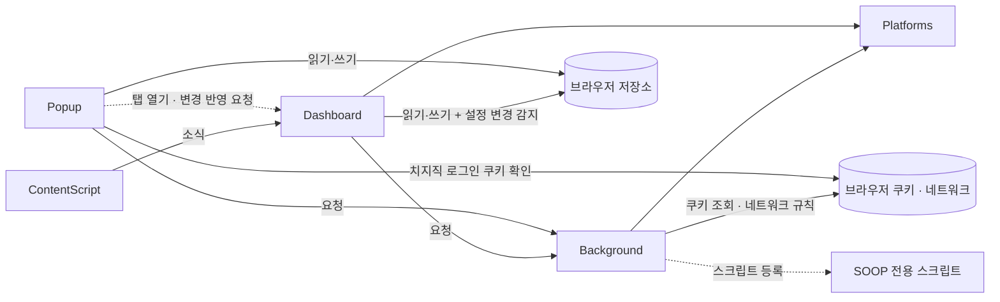

[설계서](../../../README.md) › [구현](../README.md) › 모듈

# 모듈

> **다루는 내용:** 모듈 구성 · 왜 이렇게 나뉘는가 · 의존 방향 · 통신 규칙, 모듈 문서 목록
> **갱신 트리거:** 모듈이 추가·제거되거나 모듈 사이 의존·통신 방식이 바뀔 때

## 본문

### 모듈 구성

| 모듈 | 실행 환경 | 맡은 일 |
|---|---|---|
| [Background](Background.md) | 서비스 워커 | 로그인 쿠키 싣기 · 끼워 넣기 제한 해제 규칙, 팔로잉·생방송 조회 대리, SOOP 전용 스크립트 등록 |
| [Popup](Popup.md) | 확장 팝업 페이지 | 시청 목록·즐겨찾기·저장된 목록·설정 관리, 대시보드 열기 |
| [Dashboard](Dashboard.md) | 확장 페이지 탭 | 방송 칸 조립, 배치, 자동 동기화 |
| [ContentScript](ContentScript.md) | 방송 페이지 안 (콘텐츠 스크립트) | 딜레이 측정, 넓은 화면 전환, 채팅 접기, 광고 건너뛰기 |
| [Platforms](Platforms.md) | Background · Dashboard에 각각 로드되는 공유 코드 | 치지직·SOOP 차이를 같은 모양으로 감쌈 |

| 흐름 문서 | 다루는 내용 |
|---|---|
| [생명주기](Lifecycle.md) | 설치·브라우저 시작 때 하는 일, 실행 환경이 언제 생기고 사라지는지 |
| [조작 흐름](Interactions.md) | 사용자 조작 때 모듈들이 주고받는 순서 |

### 1. 왜 이렇게 나뉘는가

Background · Popup · Dashboard · ContentScript의 경계는 **우리가 나눈 것이 아니라 크롬 확장 프로그램(Manifest V3)이 강제하는 실행 환경 경계**다. 각 환경의 성질은 [제약](../../Requirements/Constraints.md#3-브라우저가-나눠-놓은-실행-환경)에 있다. 여기서는 그 성질 때문에 정한 것만 적는다.

- 팝업은 값을 들고 있지 못하고 서비스 워커도 언제든 꺼질 수 있으므로, Popup과 Dashboard가 함께 쓰는 상태는 **브라우저 저장소(`chrome.storage.local`)**를 매개로 삼는다 — 무엇을 저장하는지는 [데이터](../../Requirements/Data.md)
- 네트워크 규칙처럼 **늘 걸려 있어야 하는 것**은 설치·업데이트와 브라우저 시작 때 깨어나는 서비스 워커(Background)가 건다.
- Dashboard는 확장 페이지라 확장 기능을 쓸 수 있지만, 외부 조회는 직접 하지 않고 Background에 맡긴다.
- 이 중 **Platforms만 우리가 만든 분할**이다. Background와 Dashboard 양쪽이 필요로 해서 공유 코드로 뺐다.
- 실행 환경 넷은 위아래로 쌓인 계층이라기보다 **나란히 놓인 경계**에 가깝다. 위아래 의존이 있는 것은 Platforms뿐이다.
- 화면과 로직을 가르는 방식(MVC·MVP 등)은 이 경계와 별개의 축이라, 각 실행 환경 **안에서** 따로 정할 문제다. 지금은 그런 규칙을 두지 않았고 파일을 화면 영역별로만 나눠 두었다.

### 2. 의존 방향



- Platforms는 역방향 의존이 없다. Popup은 Platforms를 로드하지 않는다.
- ContentScript는 Dashboard에 **소식을 보내기만** 한다. Dashboard가 보내는 지시는 없고, 칸을 다시 읽을 때는 방송 화면의 주소를 다시 넣을 뿐이다.
- Popup은 치지직 로그인 여부를 판단하려고 쿠키를 **직접** 본다. 있는지만 보는 것이라 Background를 거치지 않는다.

### 3. 통신 규칙

| 구간 | 방식 | 용도 |
|---|---|---|
| Popup → Background | 확장 메시지 요청·응답 | 팔로잉 목록 · 생방송 상태 · SOOP 로그인 여부 조회 |
| Popup ↔ 브라우저 저장소 | 읽기·쓰기 | 시청 목록 · 즐겨찾기 · 저장된 목록 · 설정 |
| Popup → Dashboard 탭 | 탭에 보내는 확장 메시지 | 대시보드 열기를 눌렀을 때 지금 시청 목록 전달 |
| Popup → 브라우저 쿠키 | 읽기 | 치지직 로그인 여부 판단 |
| Dashboard → Background | 확장 메시지 요청·응답 | 생방송 상태 · 프로필 사진 조회 |
| Dashboard ↔ 브라우저 저장소 | 읽기·쓰기 + 변경 감지 | 시청 목록·배치 읽기, 칸을 닫을 때 시청 목록·배치 쓰기, 설정 변경 감지 |
| 방송 화면 → Dashboard | 창 사이 메시지 | 딜레이 · 넓은 화면 전환 결과 · 광고 상태 |
| Background ↔ 브라우저 | 쿠키 조회 · 선언적 네트워크 규칙 | 로그인 쿠키 싣기, 끼워 넣기 제한 걷어 내기 |
| Background → 브라우저 | 스크립트 등록 | SOOP 전용 스크립트를 페이지와 같은 실행 영역에 등록 |

### 참고: 구현 파일 위치

아래는 모듈이 현재 어느 파일에 있는지 보여주는 색인이다. 책임과 입출력은 위 본문과 모듈 문서를 기준으로 하고, **이 트리는 파일이 바뀌어도 갱신 의무가 없는 참고용**이다.

```
source/
├── manifest.json          권한 선언, content_scripts 등록
├── background.js          [Background] 쿠키 주입 규칙, 끼워 넣기 제한 해제 규칙, 팔로잉·생방송 API fetch 대리
├── content.js             [ContentScript · 격리 월드] 음소거 해제, 딜레이 측정, 와이드 모드, 채팅 접기, 광고 건너뛰기
├── content-soop-main.js   [ContentScript · MAIN 월드] SOOP 로컬 앱 연결 요청 차단
├── platforms/             [Platforms]
│   ├── chzzk.js           치지직 어댑터 (생방송 상태, 프로필, 팔로잉, 방송 주소)
│   ├── soop.js            SOOP 어댑터 (생방송 상태, 프로필, 팔로잉)
│   └── index.js           어댑터 진입점 (getPlatform)
├── popup.html             [Popup] 팝업 UI (시청목록 / 기타설정 2탭)
├── popup/
│   ├── main.js            DOM 초기화, 탭·버튼 이벤트, 알림 표시
│   ├── storage.js         스토리지 로드/저장, 시청 목록 삭제·이동·복사, 즐겨찾기 트리 로드/저장
│   ├── watchlist.js       시청 목록 렌더링, 직접 추가 이벤트
│   ├── favorite-tree.js   즐겨찾기 폴더 트리 렌더링 및 드래그앤드롭
│   ├── following.js       팔로잉 목록 불러오기 및 렌더링, 치지직 로그인 쿠키 확인
│   ├── settings.js        설정 저장
│   ├── list-store.js      저장된 목록 저장소, 시청 목록 통째로 갈아끼우기
│   ├── list-format.js     공유 글 만들기·읽기
│   ├── saved-lists.js     저장된 목록 화면, 받은 글 덮어쓰기
│   └── dashboard-sync.js  열린 대시보드 찾기·변경 알리기
├── dashboard.html         [Dashboard] 멀티뷰 대시보드 UI
├── dashboard/
│   ├── main.js            DOM 초기화, 공유 상태, 방송 화면 소식 수신
│   ├── layout-tree.js     배치 트리 계산 (자동 배치, 칸 추가/제거/교환, 좌표, 비율)
│   ├── layout-view.js     배치를 화면에 반영, 경계 드래그, 배치 저장
│   ├── layout-drag.js     손잡이 드래그로 자리 옮기기·쪼개기
│   ├── panel.js           칸 조작 줄과 메뉴, 영역 확대, 좁은 칸 축소
│   ├── player.js          iframe 생성, 칸 상자 생성, 생방송 조회, 안내
│   └── control.js         자동 동기화, 채널 표시 방식
└── resources/
    ├── main_icon_16.png   툴바 아이콘
    ├── main_icon_32.png   HiDPI 툴바 아이콘
    ├── main_icon_48.png   확장 관리 페이지 아이콘
    ├── main_icon_128.png  웹스토어 아이콘
    ├── icon.png           원본 아이콘
    ├── chzzk_icon_16.jpg  팝업 내 치지직 플랫폼 아이콘
    └── soop_icon_16.jpg   팝업 내 SOOP 플랫폼 아이콘
```
