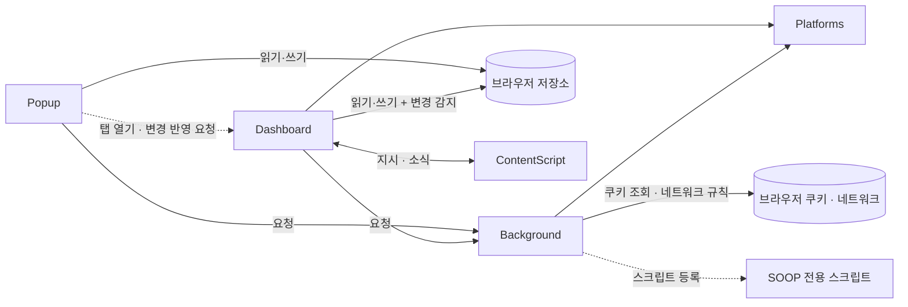
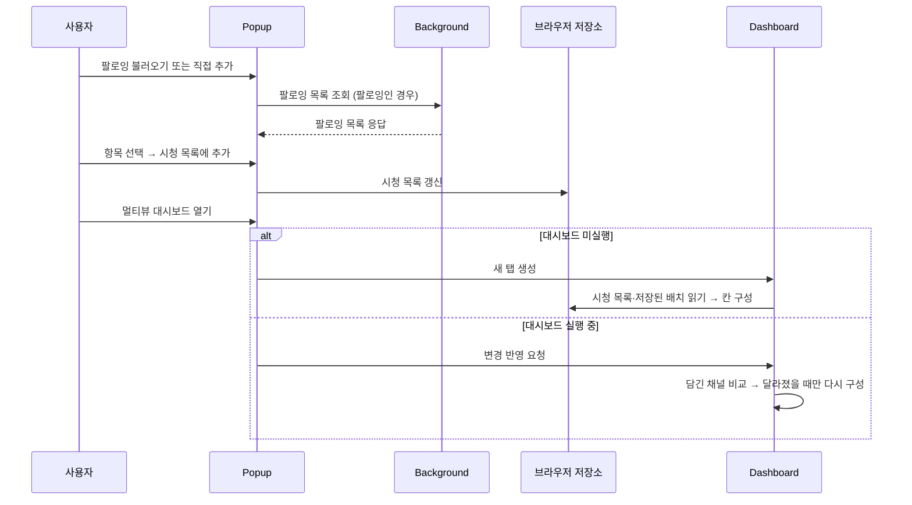

[설계서](../../README.md) › [Logical-Viewpoint](README.md) › Architecture

# Architecture

> **다루는 내용:** 계층 구성 · 의존 방향 · 통신 규칙
> **갱신 트리거:** 계층이 추가·제거되거나 계층 간 통신 방식이 바뀔 때

## 본문

### 계층 구성

계층 이름을 누르면 해당 모듈의 책임·계약 문서로 이동한다. 이 표가 하위 문서 목록을 겸한다.

| 계층 | 실행 컨텍스트 | 역할 |
|---|---|---|
| [Background](Components/Background.md) | Service Worker | 로그인 세션 쿠키 주입, 팔로잉/생방송 상태 API 대리 호출 |
| [Popup](Components/Popup.md) | 팝업 페이지 | 시청 목록·즐겨찾기·설정 관리, 대시보드 열기 |
| [Dashboard](Components/Dashboard.md) | 대시보드 탭 | 멀티뷰 화면 조립, 칸 배치, 자동 동기화 |
| [Platforms](Platforms.md) | Background · Dashboard에 각각 로드되는 공유 라이브러리 | 치지직/SOOP 차이를 동일 인터페이스로 흡수 |

- 방송 페이지 iframe 안에서 도는 [ContentScript](Components/ContentScript.md)도 별도 실행 컨텍스트이지만, Dashboard가 만든 iframe 안에서만 동작하고 Dashboard와만 대화하므로 [Dashboard](Components/Dashboard.md)의 하위 문서로 둔다. 다만 SOOP MAIN 월드 스크립트를 등록하는 쪽은 Background다.
- Background와 Platforms는 Popup·Dashboard 양쪽이 쓰는 공유 계층이라 특정 계층의 하위에 두지 않는다.

### 1. Chrome MV3 실행 환경

계층이 왜 이 모양인지, 서로 어떻게 이어져 있는지를 다룬다. 경계 자체는 브라우저가 강제한 것이라 우리가 바꿀 수 없다.

#### 1.1 왜 이렇게 나뉘는가

위 계층 중 **Background · Popup · Dashboard와 ContentScript는 우리가 나눈 것이 아니라 Chrome 확장 프로그램(Manifest V3)이 강제하는 실행 환경 경계**다. 서로 다른 실행 환경이라 **함수를 직접 불러 쓸 수 없고**, 메시지를 보내거나 브라우저 저장소를 거쳐야만 대화할 수 있다. 1.3 통신 규칙과 2.2 공유 상태가 필요한 까닭이 이것이다.

| 실행 환경 | 브라우저가 강제하는 성질 |
|---|---|
| Service Worker | 화면이 없다. 로그인 쿠키를 읽고 네트워크 규칙을 거는 권한이 **여기에만** 있다. 할 일이 없으면 브라우저가 꺼버리므로 값을 오래 들고 있지 못한다 |
| 팝업 페이지 | 툴바 아이콘을 누를 때 만들어지고 **닫는 순간 통째로 사라진다.** 기억해야 할 값은 반드시 브라우저 저장소에 넣어야 한다 |
| 대시보드 탭 | 일반 탭이라 오래 산다. 대신 확장 권한이 없어, 쿠키나 네트워크가 필요하면 Background에 부탁한다 |
| 방송 페이지 안 | 남의 페이지에 얹혀 도는 격리된 환경. 그 페이지의 화면만 만질 수 있다 |

- 팝업이 값을 들고 있지 못하고 Background도 언제든 꺼질 수 있으므로, Popup과 Dashboard의 공유 상태는 2.2 공유 상태처럼 브라우저 저장소를 매개로 삼는다.
- 위 계층 중 **Platforms만 우리가 만든 분할**이다. 치지직과 SOOP의 차이를 같은 모양으로 감싸는 어댑터이며, Background와 Dashboard 양쪽이 필요로 해서 공유 계층으로 뺐다.
- 이 문서는 "계층"이라 부르지만, 실행 환경 넷은 위아래로 쌓인 계층이라기보다 **나란히 놓인 경계**에 가깝다. 위아래 방향의 의존이 있는 것은 Platforms뿐이다.
- 화면과 로직을 가르는 방식(MVC·MVP 등)은 이 경계와 별개의 축이라, 각 실행 환경 **안에서** 따로 정할 문제다. 현재는 어느 쪽에도 그런 규칙을 두지 않았고, 파일은 화면 영역별로만 나눠 두었다.

#### 1.2 의존 방향



- Platforms는 Background와 Dashboard 양쪽에 각각 로드되는 공유 계층으로, 역방향 의존이 없다.
- Popup은 Platforms를 로드하지 않는다. 팔로잉·생방송 상태가 필요하면 반드시 Background를 거친다.
- ContentScript는 Background·Popup과 직접 연결되지 않고, 오직 자신을 담고 있는 Dashboard와만 대화한다.

#### 1.3 통신 규칙

| 구간 | 방식 | 용도 |
|---|---|---|
| Popup → Background | 요청·응답 | 팔로잉 목록 · 생방송 상태 · SOOP 로그인 여부 조회 |
| Popup ↔ 브라우저 저장소 | 읽기·쓰기 | 시청 목록 · 즐겨찾기 · 설정 |
| Popup → Dashboard 탭 | 요청 | 대시보드가 이미 열려 있을 때 변경사항 반영 |
| Dashboard → Background | 요청·응답 | 생방송 상태 · 프로필 사진 조회 |
| Dashboard ↔ 브라우저 저장소 | 읽기·쓰기 + 변경 감지 | 시청 목록·배치 읽기, 설정 변경 실시간 반영 |
| Dashboard ↔ 방송 화면 | 지시·소식 | 음량 제어, 딜레이·광고 상태 수신, 넓은 화면 재시도 요청 |
| Background ↔ 브라우저 | 쿠키 조회 · 네트워크 규칙 | 로그인 쿠키를 읽어 방송 화면·조회 요청에 실어 보냄 |
| Background → SOOP 전용 스크립트 | 스크립트 등록 | SOOP 방송 화면의 로컬 앱 연결 차단 |

**주의**
- ⚠️ 브라우저는 확장 프로그램이 만든 화면에 로그인 쿠키를 자동으로 실어 주지 않는다. Background가 네트워크 규칙으로 직접 실어 보내 이를 우회한다.

### 2. 계층을 가로지르는 동작

어느 한 모듈의 일이 아니라 여러 계층이 함께 만들어 내는 것들이다. 그래서 각 모듈 문서가 아니라 여기에 둔다.

#### 2.1 시작 흐름

스트리머를 추가해 시청을 시작하기까지, 다섯 주체가 주고받는 순서다.



- 대시보드가 이미 열려 있으면 **새 탭을 만들지 않는다.** 기존 탭으로 이동하며 바뀐 목록만 전달한다.

#### 2.2 공유 상태

Popup과 Dashboard가 직접 연결되어 있지 않을 때도 브라우저 저장소를 매개로 상태를 공유한다.

| 저장하는 것 | 내용 | 주로 쓰는 쪽 |
|---|---|---|
| 시청 목록 | 띄울 채널 목록. **순서는 첫 배치를 만들 때만 쓴다** | Popup(읽기·쓰기) · Dashboard(읽기 + 칸을 닫을 때 쓰기) |
| 즐겨찾기 트리 | 폴더 구조로 보관한 채널 | Popup |
| 저장된 목록 | 이름을 붙여 보관한 시청 목록 한 벌들. 채널마다 고유 ID·닉네임·플랫폼을 담는다 | Popup |
| 구 형식 즐겨찾기 | 예전 버전이 남긴 목록. 트리가 없을 때만 읽어 트리로 옮긴다 | Popup(읽기) |
| 시스템 설정 | 자동 동기화 여부·기준 시간·방송 칸 채널 표시 방식. 읽을 때 예전 형식 값을 현재 체계로 바꾼다 | Popup(쓰기) · Dashboard(읽기, 변경 시 실시간 반영) |
| 대시보드 배치 | 칸 구조와 비율 | Dashboard(읽기·쓰기) |

### 기술 스택

- Chrome 확장 프로그램 (Manifest V3)
- 순수 JS — 프레임워크·번들러 없음
- 네트워크 규칙 변조 — 확장 프로그램 화면에 로그인 쿠키를 실어 보내기 위해
- 브라우저 저장소 — 시청 목록 / 즐겨찾기 / 설정 영구 보관
- 화면 간 메시지 — 대시보드와 방송 화면 사이 음량 제어·상태 수신

### 참고: 구현 파일 위치

아래는 위 계층·모듈이 현재 어느 파일에 있는지 보여주는 색인이다. 계층별 책임과 계약은 위 본문과 하위 문서를 기준으로 하고, **이 트리는 파일이 바뀌어도 갱신 의무가 없는 참고용**이다.

```
source/
├── manifest.json          권한 선언, content_scripts 등록
├── background.js          [Background] 쿠키 주입 규칙, 팔로잉·생방송 API fetch 대리
├── content.js             [ContentScript · 격리 월드] 볼륨 제어, 딜레이 측정, 와이드 모드, 채팅 접기
├── content-soop-main.js   [ContentScript · MAIN 월드] SOOP 로컬 앱 연결 요청 차단
├── platforms/             [Platforms]
│   ├── chzzk.js           치지직 어댑터 (생방송 상태, 프로필, 팔로잉, 채팅 URL)
│   ├── soop.js            SOOP 어댑터 (생방송 상태, 프로필, 팔로잉)
│   └── index.js           어댑터 진입점 (getPlatform)
├── popup.html             [Popup] 팝업 UI (시청목록 / 기타설정 2탭)
├── popup/
│   ├── main.js            DOM 초기화, 탭·버튼 이벤트, 알림 표시
│   ├── storage.js         스토리지 로드/저장, 시청 목록 삭제·이동·복사, 즐겨찾기 트리 로드/저장
│   ├── watchlist.js       시청 목록 렌더링, 직접 추가 이벤트
│   ├── favorite-tree.js   즐겨찾기 폴더 트리 렌더링 및 드래그앤드롭
│   ├── following.js       팔로잉 목록 불러오기 및 렌더링
│   └── settings.js        설정 저장
├── dashboard.html         [Dashboard] 멀티뷰 대시보드 UI
├── dashboard/
│   ├── main.js            DOM 초기화, 공유 상태, 방송 화면 소식 수신
│   ├── layout-tree.js     배치 트리 계산 (자동 배치, 칸 추가/제거/교환, 좌표, 비율)
│   ├── layout-view.js     배치를 화면에 반영, 경계 드래그, 배치 저장
│   ├── layout-drag.js     손잡이 드래그로 자리 옮기기·쪼개기
│   ├── panel.js           칸 조작 줄과 메뉴, 영역 확대
│   ├── player.js          iframe 생성, 칸 상자 생성, 생방송 조회, 안내
│   └── control.js         자동 동기화, 채널 표시 방식
└── resources/
    ├── main_icon_16.png   툴바 아이콘
    ├── main_icon_32.png   HiDPI 툴바 아이콘
    ├── main_icon_48.png   확장 관리 페이지 아이콘
    ├── main_icon_128.png  웹스토어 아이콘
    ├── icon.png           원본 아이콘
    ├── chzzk_icon_16.jpg  팝업 내 치지직 플랫폼 아이콘
    └── soop_icon_16.jpg   팝업 내 SOOP 플랫폼 아이콘
```
