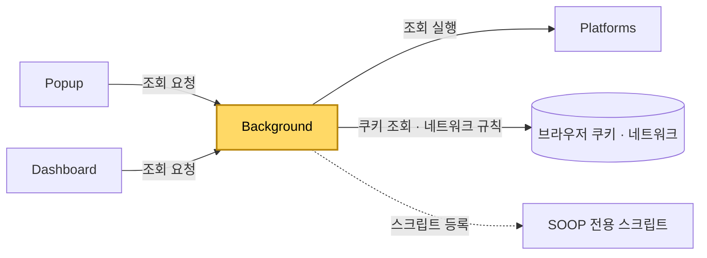

[설계서](../../../README.md) › [Logical-Viewpoint](../README.md) › [Components](../Components.md) › Background

# Background

> **다루는 내용:** 백그라운드 서비스 워커의 책임과 계약 (입력/트리거/출력)
> **갱신 트리거:** 책임 범위나 입출력 계약이 바뀔 때

## 본문

**책임**
확장 프로그램의 인증·네트워크 대리 계층. 브라우저에 저장된 로그인 세션 쿠키를 읽어 방송 화면과 조회 요청에 실어 보내고, 플랫폼이 건 끼워 넣기 제한을 대시보드가 띄운 방송 화면에 한해 풀어 주며, Popup·Dashboard를 대신해 외부 조회를 수행한다.

**트리거**

| 시점 | 하는 일 |
|---|---|
| 확장 설치·업데이트 | 네트워크 규칙 정리, 끼워 넣기 제한 풀기, 쿠키 싣기, SOOP 전용 스크립트 등록 |
| 브라우저 시작 | 네트워크 규칙 정리, 끼워 넣기 제한 풀기, 쿠키 싣기 |
| 치지직·SOOP 쿠키 변경 | 로그인·로그아웃으로 보고 쿠키를 다시 싣는다 |
| Popup·Dashboard의 요청 | 로그인 확인 · 팔로잉 목록 · 생방송 상태 조회 |

**입력**

| 받는 것 | 어디서 | 내용 |
|---|---|---|
| 조회 요청 | Popup · Dashboard | 무엇을 조회할지, 어느 플랫폼의 어느 채널인지 |
| 로그인 쿠키 | 브라우저 | 치지직·SOOP 세션. 수집 범위는 플랫폼마다 다르다 — [치지직](../../Development-Viewpoint/Platforms/Chzzk.md) · [SOOP](../../Development-Viewpoint/Platforms/Soop.md) 참고 |

**출력**

| 내보내는 것 | 받는 쪽 | 내용 |
|---|---|---|
| 네트워크 규칙 | 브라우저 | 방송 화면과 조회 요청에 로그인 쿠키를 실어 보낸다 |
| 네트워크 규칙 | 브라우저 | 대시보드가 띄운 방송 화면에서 플랫폼의 끼워 넣기 제한을 걷어 낸다. 걸리는 플랫폼과 제한 내용은 [치지직](../../Development-Viewpoint/Platforms/Chzzk.md#15-다른-페이지-안에-끼워-넣기-제한) 참고 |
| 조회 응답 | Popup · Dashboard | 조회 성공 여부와 결과 / 생방송 여부와 프로필 사진 주소 / 로그인 여부 |
| SOOP 전용 스크립트 등록 | 브라우저 | 페이지와 같은 실행 영역에 등록. 설치·업데이트 때만 하며, 브라우저를 껐다 켜도 유지된다 |

**기대 동작 — 끼워 넣기 제한 풀기**

| 상황 | 기대 동작 |
|---|---|
| 대시보드 칸에 치지직 방송을 띄움 — 로그인 상태 | 방송이 뜬다. 로그인된 화면이다 |
| 대시보드 칸에 치지직 방송을 띄움 — 로그아웃 상태 | 방송이 뜬다. 로그인 안 된 화면이다 |
| 치지직을 일반 탭으로 엶 | 달라지는 것이 없다 |
| 다른 웹사이트가 자기 페이지에 치지직을 끼워 넣음 | **지금처럼 막힌다** |
| 확장을 설치·업데이트한 직후, 브라우저를 다시 켠 직후 | 대시보드를 열면 바로 뜬다. 따로 할 일이 없다 |

**다른 모듈과의 관계**

- Platforms 어댑터를 직접 로드해서 쓴다. 실제 조회 로직 자체는 Platforms 쪽 책임이다.
- Popup·Dashboard는 이 계층을 거치지 않고는 팔로잉 목록·생방송 상태를 알 수 없다. 직접 조회하지 않는다.

**주의**
- ⚠️ 공식 개발자 API를 쓰지 않고 브라우저에 남은 로그인 흔적만으로 판단한다. 세션이 만료되거나 플랫폼이 쿠키 이름을 바꾸면 동작하지 않는다.
- ⚠️ 로그인 판단 방식이 플랫폼마다 달라 **치지직 쪽에만 오탐이 생긴다.** 각 방식과 까닭은 [치지직](../../Development-Viewpoint/Platforms/Chzzk.md) · [SOOP](../../Development-Viewpoint/Platforms/Soop.md) 참고.
- ⚠️ 브라우저는 확장 프로그램이 만든 화면에 로그인 쿠키를 자동으로 실어 주지 않는다. 그래서 이 계층이 네트워크 규칙으로 직접 실어 보낸다. 이 규칙이 없으면 로그인이 되어 있어도 방송이 나오지 않는다.
- ⚠️ 끼워 넣기 제한은 **대시보드가 띄운 방송 화면에서만** 걷어 낸다. 같은 페이지라도 다른 곳에서 열리거나 끼워진 것에는 손대지 않는다.[^1]
- ⚠️ 끼워 넣기 제한 풀기는 **로그인 여부와 무관하게** 늘 걸어 둔다. 쿠키 싣기와 한데 묶지 않는다. 쿠키 싣기는 쿠키가 있을 때만 걸리므로, 묶으면 로그아웃 상태에서 방송 화면 자체가 막힌다.
- ⚠️ 제한이 실린 헤더는 **통째로** 걷어 낸다. 확인일 기준 그 헤더에는 끼워 넣기 제한 하나만 실려 있어 다른 보호가 함께 사라지지 않는다. 같은 헤더에 다른 규칙이 실리기 시작하면 다시 판단한다.[^2]

[^1]: 범위를 좁힌 까닭 — 이 제한은 다른 사이트가 방송 페이지를 몰래 덮어씌워 사용자의 클릭을 가로채는 공격을 막는 보호 장치다. 치지직 페이지 전체에서 걷어 내면 확장을 설치한 사용자가 **다른 사이트에서 그 보호를 잃는다.** 탈락한 대안: 치지직 페이지 전체에서 걷어 내기 — 구현은 가장 단순하지만 위 이유로 버렸다.
[^2]: 헤더 안의 일부만 고쳐 쓰는 방법도 있다. 탈락 이유 — 고쳐 쓸 값을 우리가 미리 정해 두어야 해서, 치지직이 허용 목록이나 다른 규칙을 바꾸면 우리 값이 낡은 채로 덮어쓰게 된다. 지금은 걷어 낼 다른 규칙이 없으므로 통째로 걷어 내는 쪽이 낡을 일이 없다.
