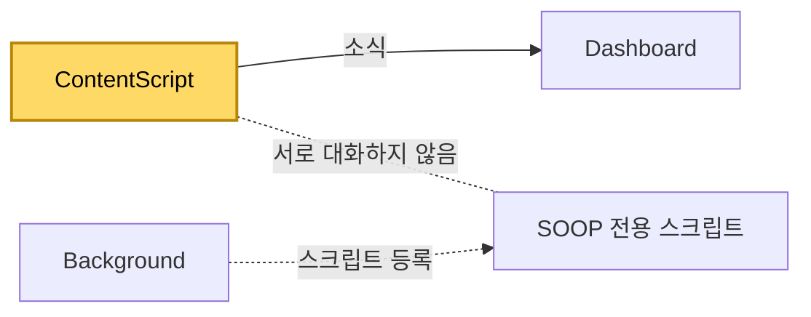

[설계서](../../../README.md) › [Logical-Viewpoint](../README.md) › [Components](../Components.md) › ContentScript

# ContentScript

> **다루는 내용:** 방송 화면 안에서 도는 스크립트의 책임과 계약 (입력/트리거/출력)
> **갱신 트리거:** 책임 범위나 입출력 계약이 바뀔 때

## 본문

**책임**
Dashboard가 만든 방송 화면 안에 들어가, 딜레이 측정·넓은 화면 자동 전환·채팅 접기·광고 건너뛰기를 수행한다. SOOP 화면에서는 고화질 연결 안내 팝업 닫기도 함께 처리한다.

**트리거**

| 시점 | 하는 일 |
|---|---|
| 화면이 열릴 때 | 주소에 붙은 표시로 확장 프로그램이 만든 화면인지 판별하고, 아니면 즉시 종료한다 |
| 영상이 나타날 때 | 음소거를 푼다 |
| 영상이 실제로 재생을 시작할 때 | 딜레이 측정을 시작하고, 넓은 화면 전환을 시도한다 |
| 탭이 다시 보이게 됐을 때 | 넓은 화면이 풀려 있으면 다시 시도한다 |

**입력**

| 받는 것 | 어디서 | 내용 |
|---|---|---|
| 주소에 붙은 값 | Dashboard가 만든 주소 | 확장 프로그램이 만든 화면인지 |

**출력** (Dashboard로 보내는 소식)

| 소식 | 시점 |
|---|---|
| 방송 딜레이 | 재생이 시작된 뒤부터 1초 주기 |
| 넓은 화면 전환 결과 | 성공 또는 실패로 끝났을 때 |
| 광고 재생 여부 변화 | 광고가 시작되거나 끝날 때 |

**기대 동작 — 방송 딜레이 보내기**

| 상황 | 기대 동작 |
|---|---|
| 방송 화면이 막 열려 아직 재생 전 | 딜레이를 **보내지 않는다** |
| 재생이 시작됨 | 그때부터 1초마다 보낸다 |
| 열린 뒤 재생이 좀처럼 시작되지 않음 | 보내지 않는다. 판단은 대시보드의 [무신호 판정](Dashboard.md#22-자동-동기화--비방송-확인)에 맡긴다 |
| 이미 재생 중인 영상을 뒤늦게 잡음 | 바로 보내기 시작한다 |

**소리에 관해 하는 일**

영상을 처음 잡았을 때 **음소거를 한 번 풀어 주는 것**이 전부다. 그 뒤로는 건드리지 않는다.

**다른 모듈과의 관계**

- Dashboard에 소식을 **보내기만 한다.** 받는 지시는 없고, Background·Popup과도 직접 연결이 없다.
- SOOP 전용 스크립트는 같은 화면 안에서 함께 돌지만 역할이 분리되어 있다. 그 스크립트가 하는 일은 [SOOP](../../Development-Viewpoint/Platforms/Soop.md) 참고.

**주의**
- ⚠️ 음량 크기는 **절대 덮어쓰지 않는다.** 값을 지정하면 방송 페이지가 그것을 채널별 상태로 저장해, 다시 불러올 때 페이지가 보여주는 상태와 실제 소리가 어긋난다.
- ⚠️ 화면이 보이지 않는 탭에서는 넓은 화면 전환이 먹지 않을 수 있어, 탭으로 돌아왔을 때 전환되어 있지 않으면 다시 시도한다.
- ⚠️ 딜레이는 **방송이 진행된 끝 지점 − 지금 재생 위치**로 계산한다. 영상이 없으면 값이 나오지 않는다.
- ⚠️ **재생이 시작되기 전에는 딜레이를 보내지 않는다.** 막 열린 순간 재생 위치는 0인데 방송 끝 지점은 이미 수십 초 뒤라, 그때 재면 실제로는 밀리지 않았는데도 크게 밀린 것으로 나온다. 그 값을 받은 대시보드가 칸을 쓸데없이 다시 읽는다.[^1]
- ⚠️ 이 소식은 대시보드에서 **영상 신호가 살아 있다는 표시로도** 쓰인다. 재생 전에 보내지 않으므로, 열린 뒤 재생이 오래 시작되지 않는 칸은 대시보드가 신호 없음으로 보고 다시 읽는다.

[^1]: 2026-10-07 진단 기록에서 확인. 대시보드를 열 때마다 칸이 재생 위치 0인 상태에서 "딜레이 30초"로 보고되어, 열린 지 1~2초 만에 한 번 더 읽혔다. 눈에는 로딩이 조금 길어진 것으로만 보여 드러나지 않았다. 탈락한 대안: 대시보드가 처음 들어온 큰 값을 무시하기 — 대시보드는 그 값이 재생 전에 잰 것인지 알 수 없어, 실제로 크게 밀린 경우까지 놓칠 수 있다. 재는 쪽에서 막는 것이 정확하다.
