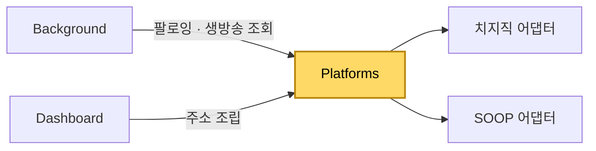

[설계서](../README.md) › [Architecture](Architecture.md) › Platforms

# Platforms

> **다루는 내용:** 플랫폼 어댑터의 책임과 계약 (입력/트리거/출력)
> **갱신 트리거:** 지원 플랫폼이 추가·제거되거나 어댑터 계약이 바뀔 때

## 하위 문서

| 문서 | 다루는 내용 |
|---|---|
| [치지직](Chzzk.md) | 치지직이 정한 주소·쿠키·화면 요소 |
| [SOOP](Soop.md) | SOOP이 정한 주소·쿠키·화면 요소, 고화질 재생 대응 |

## 본문

**책임**
치지직과 SOOP의 차이(팔로잉 조회, 방송 주소, 생방송 상태 조회)를 **동일한 인터페이스로 감싸는 어댑터 계층.** 호출하는 쪽이 어느 플랫폼인지 신경 쓰지 않고 같은 방식으로 쓸 수 있게 한다.

**트리거**

| 시점 | 하는 일 |
|---|---|
| 호출하는 쪽이 플랫폼 이름으로 어댑터를 찾을 때 | 그 플랫폼의 어댑터를 돌려준다 |

**계약** (모든 어댑터가 공통으로 구현)

| 기능 | 받는 것 | 돌려주는 것 | 네트워크 |
|---|---|---|---|
| 팔로잉 목록 조회 | 없음 (로그인 쿠키에 의존) | 팔로잉한 채널 목록과 성공 여부 | 있음 |
| 생방송 여부·프로필 사진 조회 | 채널 | 생방송 중인지, 프로필 사진 주소 | 있음 |
| 방송 화면 주소 만들기 | 채널, 음소거 여부 | 방송 화면 주소 | 없음 |

**다른 모듈과의 관계**

- Background와 Dashboard **양쪽에 각각 로드되는 공유 계층**이라 역방향 의존이 없다.
- 네트워크 호출이 필요한 조회는 Background에서만 실행한다. Dashboard는 주소 조립에만 쓴다.
- Popup은 이 계층을 로드하지 않는다. 필요하면 반드시 Background를 거친다.

**주의**
- ⚠️ 새 플랫폼을 추가할 때는 위 네 기능을 모두 구현해야 한다. 지원하지 않는 기능은 빈 값을 돌려주고, 호출하는 쪽이 그 빈 값을 미지원 신호로 해석한다.
- ⚠️ 플랫폼이 정한 구체적인 값(주소 형식·쿠키 이름·화면 요소)은 이 문서가 아니라 각 플랫폼 문서에 적는다. 이 문서는 플랫폼과 무관한 계약만 다룬다.
