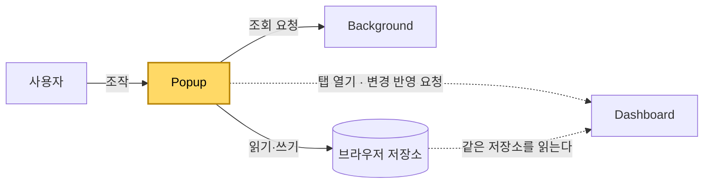

[설계서](../README.md) › [Architecture](Architecture.md) › Popup

# Popup

> **다루는 내용:** 팝업의 책임과 계약 (입력/트리거/출력)
> **갱신 트리거:** 책임 범위나 입출력 계약이 바뀔 때

## 본문

**책임**
시청 목록·즐겨찾기·설정을 관리하는 확장 프로그램의 조작 화면. 대시보드를 새로 열거나, 이미 열린 대시보드에 변경사항을 전달한다.

**트리거**

| 시점 | 하는 일 |
|---|---|
| 확장 아이콘을 눌러 팝업이 열릴 때 | 저장된 상태를 읽어 목록과 설정 화면을 구성한다 |

**입력**

| 받는 것 | 어디서 | 내용 |
|---|---|---|
| 사용자 조작 | 사용자 | 탭 전환, 드래그앤드롭, 입력창 |
| 현재 상태 | 브라우저 저장소 | 시청 목록, 즐겨찾기 트리, 저장된 목록, 시스템 설정 |
| 붙여넣은 글 | 사용자 | 남이 보낸 공유 글 |
| 조회 결과 | Background | 팔로잉 목록, 생방송 상태, SOOP 로그인 여부 |

**출력**

| 내보내는 것 | 받는 쪽 | 내용 |
|---|---|---|
| 상태 갱신 | 브라우저 저장소 | 시청 목록, 즐겨찾기 트리, 저장된 목록, 시스템 설정 |
| 공유 글 | 클립보드 | 저장된 목록 한 벌을 정해진 형식의 글로 |
| 조회 요청 | Background | 팔로잉 목록, 생방송 상태, SOOP 로그인 여부 |
| 대시보드 열기 | 새 탭 | 대시보드가 열려 있지 않을 때 |
| 변경 반영 요청 | 열려 있는 대시보드 탭 | 새 탭을 만들지 않고 그 탭으로 이동하며 바뀐 시청 목록을 전달 |

**다른 모듈과의 관계**

- Dashboard와는 **저장소를 매개로 간접 연결**된다. 대시보드 탭이 열려 있을 때만 직접 연결이 추가된다.
- Platforms 어댑터를 로드하지 않는다. 외부 조회가 필요하면 반드시 Background를 거친다.

**주의**
- ⚠️ 시청 목록은 **어떤 채널을 띄울지만** 정한다. 화면상의 자리는 대시보드가 채널마다 따로 기억하므로 목록 순서는 화면에 영향을 주지 않는다. 다만 저장된 배치가 없을 때 처음 배치를 만드는 데는 목록 순서가 쓰인다.
- ⚠️ 시청 목록을 저장소에 쓰는 것만으로는 **대시보드가 알지 못한다.** 열려 있는 대시보드 탭에 직접 알려야 그 자리에서 바뀐다. 저장된 목록을 불러올 때처럼 목록을 통째로 갈아끼우는 경우에 특히 중요하다.
- ⚠️ 저장된 목록은 즐겨찾기와 **또 다른 별개의 저장 공간**이다. 화면에서도 나란한 별개 화면으로 나뉘어 있으며, 담는 것이 채널이 아니라 시청 목록 한 벌이라 서로 섞이지 않는다.
- ⚠️ 즐겨찾기를 고치면 **시청 목록 화면도 함께 다시 그려야 한다.** 시청 목록의 각 항목이 즐겨찾기 등록 여부를 표시하기 때문에, 한쪽만 다시 그리면 표시가 옛 상태에 남는다.
