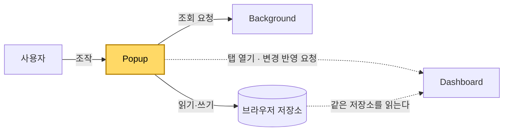

[설계서](../README.md) › [Architecture](Architecture.md) › Popup

# Popup

> **다루는 내용:** 팝업의 책임과 계약 (입력/트리거/출력)
> **갱신 트리거:** 책임 범위나 입출력 계약이 바뀔 때

## 본문

**책임**
시청 목록·즐겨찾기·설정을 관리하는 확장 프로그램의 조작 화면. 대시보드를 새로 열거나, 이미 열린 대시보드에 변경사항을 전달한다.

**트리거**

| 시점 | 하는 일 |
|---|---|
| 확장 아이콘을 눌러 팝업이 열릴 때 | 저장된 상태를 읽어 목록과 설정 화면을 구성한다 |

**입력**

| 받는 것 | 어디서 | 내용 |
|---|---|---|
| 사용자 조작 | 사용자 | 탭 전환, 드래그앤드롭, 입력창 |
| 현재 상태 | 브라우저 저장소 | 시청 목록, 즐겨찾기 트리, 시스템 설정, 대시보드 배치 |
| 조회 결과 | Background | 팔로잉 목록, 생방송 상태, SOOP 로그인 여부 |

**출력**

| 내보내는 것 | 받는 쪽 | 내용 |
|---|---|---|
| 상태 갱신 | 브라우저 저장소 | 시청 목록, 즐겨찾기 트리, 시스템 설정, 대시보드 배치 |
| 조회 요청 | Background | 팔로잉 목록, 생방송 상태, SOOP 로그인 여부 |
| 대시보드 열기 | 새 탭 | 대시보드가 열려 있지 않을 때 |
| 변경 반영 요청 | 열려 있는 대시보드 탭 | 새 탭을 만들지 않고 그 탭으로 이동하며 바뀐 시청 목록을 전달 |

**다른 모듈과의 관계**

- Dashboard와는 **저장소를 매개로 간접 연결**된다. 대시보드 탭이 열려 있을 때만 직접 연결이 추가된다.
- Platforms 어댑터를 로드하지 않는다. 외부 조회가 필요하면 반드시 Background를 거친다.

**주의**
- ⚠️ 시청 목록은 **맨 앞 항목이 곧 메인 화면**이다. 메인을 가리키는 별도 표시가 없으므로, 목록 순서를 바꾸는 모든 동작은 맨 앞이 무엇이 되는지 함께 따져야 한다.
