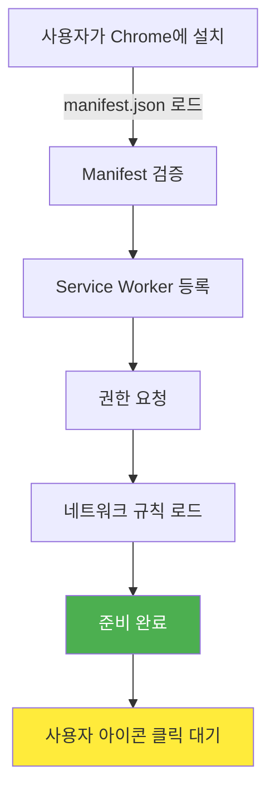
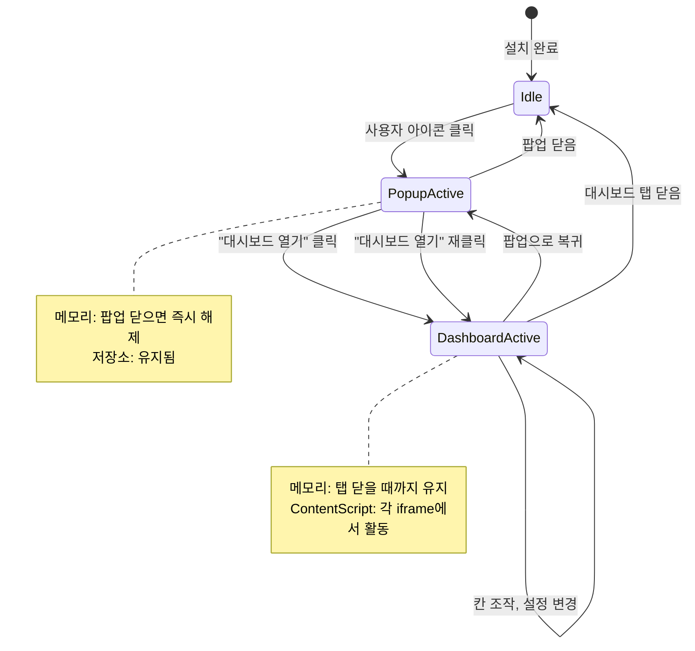
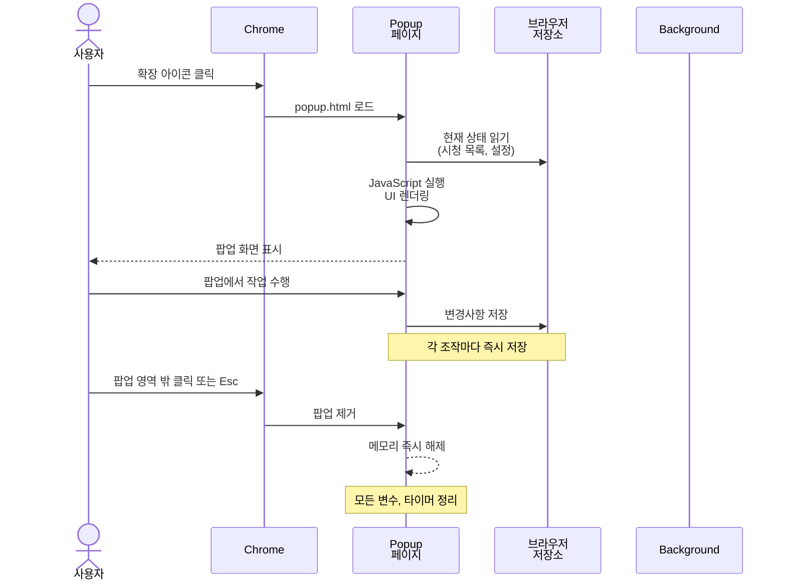
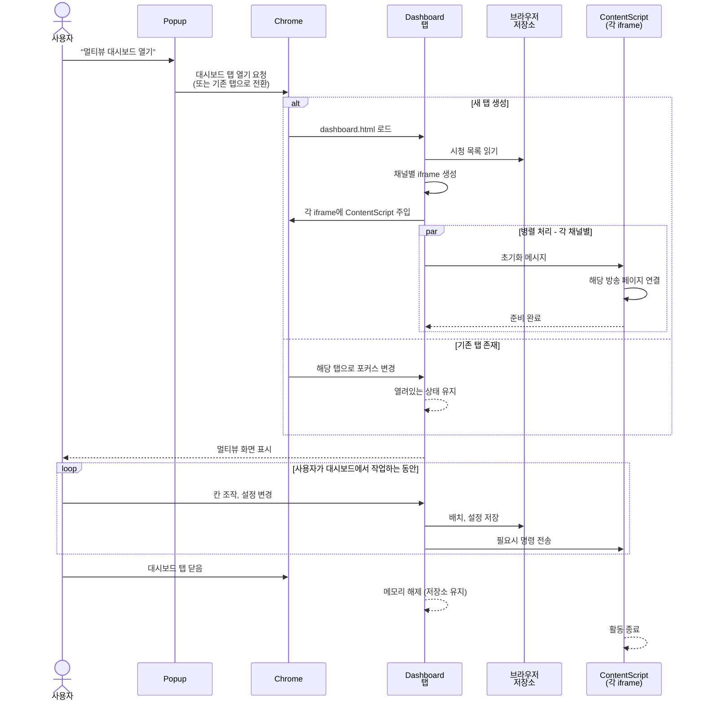

[설계서](../../README.md) › [Process-Viewpoint](README.md) › Flows-Lifecycle

# 확장 생명주기 흐름

> **다루는 내용:** 설치부터 종료까지 확장의 상태 전이
> **갱신 트리거:** 생명주기 단계가 추가되거나 상태 전이가 변경될 때

---

## 1. 초기화 단계

확장이 설치되고 처음 활성화될 때:



**포인트:**
- ✅ Service Worker는 manifest.json 로드 후 바로 등록
- ✅ 네트워크 규칙(declarativeNetRequest)은 startup 시 한 번만 로드
- ⏳ 이후 아이콘 클릭 대기

---

## 2. 런타임 상태 전이

사용자 조작에 따른 상태 전이:



**포인트:**
- 🔄 **상태:** Idle ↔ PopupActive ↔ DashboardActive
- 💾 **메모리:** 탭은 닫혀도 저장소 데이터는 영구 보존
- 🔌 **ContentScript:** Dashboard 활성 시에만 동작

---

## 3. 팝업 생명주기

사용자가 아이콘을 클릭했을 때:



**포인트:**
- ⚡ **빠른 생성:** Chrome이 popup.html 로드 후 즉시 렌더링
- 💾 **자동 저장:** 팝업은 저장소에만 기록, 메모리에 상태 없음
- 🗑️ **즉시 해제:** 닫히는 순간 메모리에서 완전 제거

---

## 4. 대시보드 생명주기

사용자가 팝업에서 "대시보드 열기"를 눌렀을 때:



**포인트:**
- 🚀 **일괄 로드:** 대시보드는 **모든 채널을 한 번에** 로드 (Popup과 다름)
- ♻️ **탭 재사용:** 이미 열려 있으면 새 탭 생성 안 함
- ⏱️ **장시간 유지:** 사용자가 닫을 때까지 메모리에 유지
- 🔌 **ContentScript 함께:** 각 iframe의 ContentScript도 함께 동작

---

## 5. 상태별 리소스 관리

```
┌─────────────────────────────────────────┐
│           Idle 상태                      │
│  • Service Worker만 백그라운드에서 대기  │
│  • 다른 리소스 없음                      │
│  • 저장소만 유지                         │
└─────────────────────────────────────────┘
           ↓ (아이콘 클릭)
┌─────────────────────────────────────────┐
│        PopupActive 상태                  │
│  • Popup 페이지 메모리                   │
│  • Popup HTML/CSS/JS                    │
│  • 저장소 Read/Write 중                  │
│  • Background와 Message 통신             │
└─────────────────────────────────────────┘
           ↓ (대시보드 열기)
┌─────────────────────────────────────────┐
│       DashboardActive 상태               │
│  • Dashboard 탭 메모리                   │
│  • N개 iframe (채널 수만큼)              │
│  • N개 ContentScript (각 iframe)        │
│  • 저장소 Read/Write + 감지              │
│  • Background와 Message 통신             │
│  ├─ Popup도 동시에 열려있을 수 있음     │
│  └─ Popup과 Dashboard는 독립적          │
└─────────────────────────────────────────┘
```

**포인트:**
- 🎯 **상태별 리소스:** 각 상태에서 필요한 리소스만 로드
- 🔄 **상태 전이:** 탭 닫음 = 메모리 해제 (저장소는 유지)
- 📊 **복수 인스턴스 가능:** Popup과 Dashboard 동시 실행 가능 (독립적)

