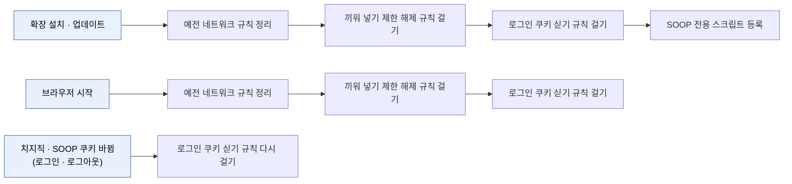
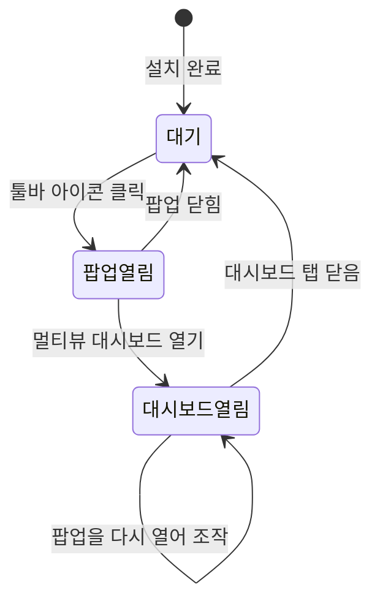
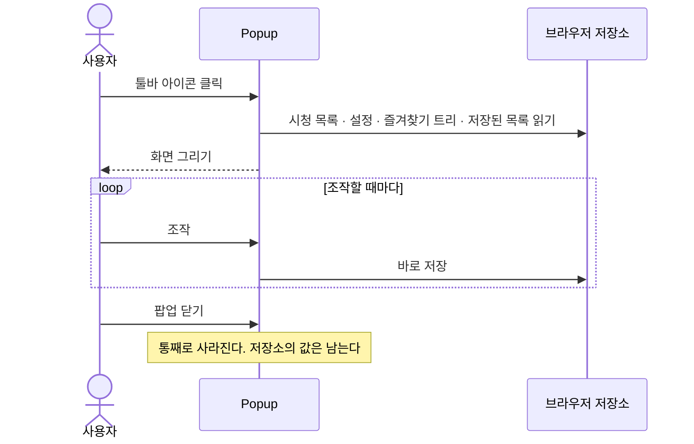
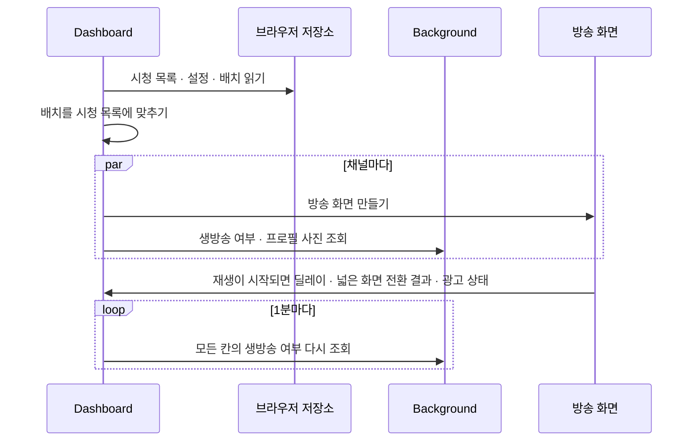

[설계서](../../README.md) › [Process-Viewpoint](README.md) › Flows-Lifecycle

# 확장 프로그램 생명주기

> **다루는 내용:** 설치부터 종료까지 각 실행 환경이 언제 생기고 사라지며 그때 무엇을 하는지
> **갱신 트리거:** 실행 환경이 생기거나 사라질 때 하는 일이 바뀔 때

## 본문

### 1. 설치·업데이트·브라우저 시작

```mermaid
flowchart LR
  A["확장 설치 · 업데이트"] --> R1["예전 네트워크 규칙 정리"]
  R1 --> R2["끼워 넣기 제한 해제 규칙 걸기"]
  R2 --> R3["로그인 쿠키 싣기 규칙 걸기"]
  R3 --> R4["SOOP 전용 스크립트 등록"]

  B["브라우저 시작"] --> S1["예전 네트워크 규칙 정리"]
  S1 --> S2["끼워 넣기 제한 해제 규칙 걸기"]
  S2 --> S3["로그인 쿠키 싣기 규칙 걸기"]

  C["치지직 · SOOP 쿠키 바뀜<br/>(로그인 · 로그아웃)"] --> K["로그인 쿠키 싣기 규칙 다시 걸기"]

  style A fill:#e8f0fe,stroke:#4a6fa5,color:#000
  style B fill:#e8f0fe,stroke:#4a6fa5,color:#000
  style C fill:#e8f0fe,stroke:#4a6fa5,color:#000
```

- 모두 Background가 한다. 걸어 둔 규칙과 등록한 스크립트는 **브라우저를 껐다 켜도 남는다.** 브라우저 시작 때 쿠키 싣기 규칙을 다시 거는 것은 그사이 바뀌었을 쿠키 값을 반영하기 위해서다. 끼워 넣기 제한 해제 규칙은 같은 내용을 다시 걸 뿐이라 영향이 없다.
- SOOP 전용 스크립트 등록은 설치·업데이트 때만 한다. 남아 있으므로 브라우저 시작 때는 다시 하지 않는다.
- 설치 때 따로 묻는 권한은 없다. 필요한 권한은 설치 시점에 한 번에 받는다.
- 각 규칙이 하는 일은 [Background](../Logical-Viewpoint/Components/Background.md) 참고.

### 2. 실행 환경이 사는 동안

```mermaid
stateDiagram-v2
  [*] --> 대기: 설치 완료
  대기 --> 팝업열림: 툴바 아이콘 클릭
  팝업열림 --> 대기: 팝업 닫힘
  팝업열림 --> 대시보드열림: 멀티뷰 대시보드 열기
  대시보드열림 --> 대시보드열림: 팝업을 다시 열어 조작
  대시보드열림 --> 대기: 대시보드 탭 닫음
```

| 실행 환경 | 생기는 때 | 사라지는 때 | 들고 있는 값 |
|---|---|---|---|
| Background | 확장 설치·업데이트, 브라우저 시작, 요청이 올 때 | 할 일이 없으면 브라우저가 끈다 | 없음. 필요한 값은 그때그때 읽는다 |
| 팝업 | 툴바 아이콘 클릭 | 팝업 바깥을 누르거나 대시보드를 열 때 | 없음. 조작할 때마다 바로 저장소에 쓴다 |
| 대시보드 | `멀티뷰 대시보드 열기` (열려 있으면 그 탭으로 이동) | 사용자가 탭을 닫을 때 | 방송 화면 상자들, 배치, 자동 동기화 상태 |
| 방송 화면 안 스크립트 | 대시보드가 방송 화면을 만들 때 브라우저가 붙인다 | 그 방송 화면이 다시 읽히거나 사라질 때 | 딜레이 측정, 넓은 화면 전환 상태 |

- 팝업과 대시보드는 **동시에 열려 있을 수 있다.** 서로 직접 연결되지 않고, 대시보드 열기를 누를 때만 팝업이 대시보드에 알린다.
- 방송 화면 안 스크립트는 **확장 프로그램이 만든 방송 화면에서만** 동작한다. 사용자가 일반 탭으로 연 방송에는 붙어도 바로 손을 뗀다 — [ContentScript](../Logical-Viewpoint/Components/ContentScript.md) 참고.

### 3. 팝업이 열릴 때

```mermaid
sequenceDiagram
  actor U as 사용자
  participant P as Popup
  participant S as 브라우저 저장소

  U->>P: 툴바 아이콘 클릭
  P->>S: 시청 목록 · 설정 · 즐겨찾기 트리 · 저장된 목록 읽기
  P-->>U: 화면 그리기
  loop 조작할 때마다
    U->>P: 조작
    P->>S: 바로 저장
  end
  U->>P: 팝업 닫기
  Note over P: 통째로 사라진다. 저장소의 값은 남는다
```

### 4. 대시보드가 열릴 때

```mermaid
sequenceDiagram
  participant D as Dashboard
  participant S as 브라우저 저장소
  participant BG as Background
  participant C as 방송 화면

  D->>S: 시청 목록 · 설정 · 배치 읽기
  D->>D: 배치를 시청 목록에 맞추기
  par 채널마다
    D->>C: 방송 화면 만들기
    D->>BG: 생방송 여부 · 프로필 사진 조회
  end
  C->>D: 재생이 시작되면 딜레이 · 넓은 화면 전환 결과 · 광고 상태
  loop 1분마다
    D->>BG: 모든 칸의 생방송 여부 다시 조회
  end
```

- 방송이 꺼져 있는 채널은 방송 화면을 비우고 "방송중이 아닙니다"를 띄운다. 다시 켜지면 그때 방송 화면을 채운다.
- 배치를 맞추는 규칙은 [저장 데이터](../Physical-Viewpoint/DataSchema.md#데이터끼리의-관계) 참고.
