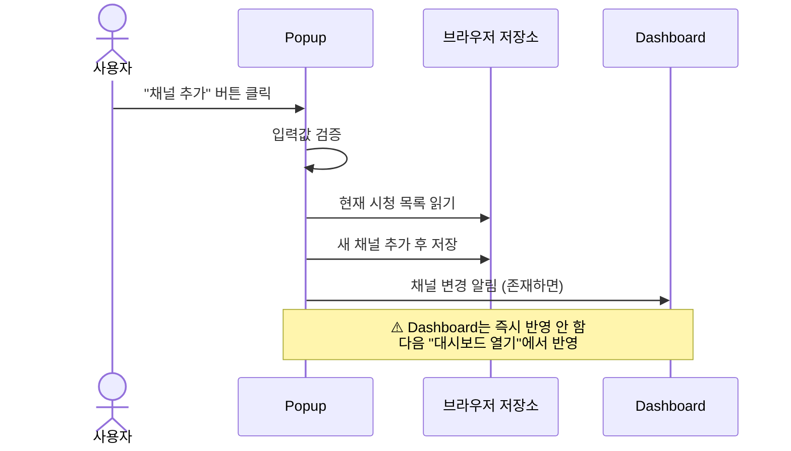
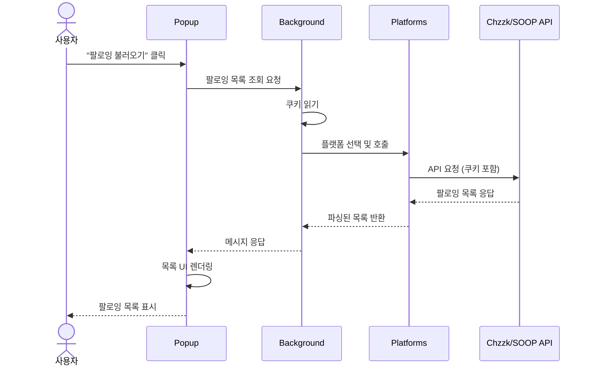
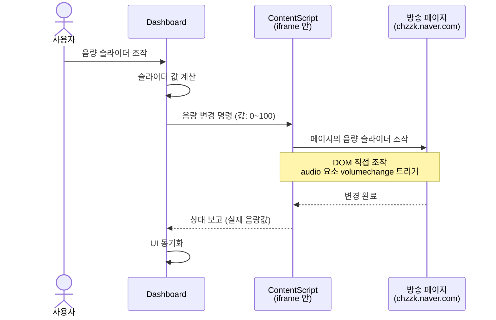
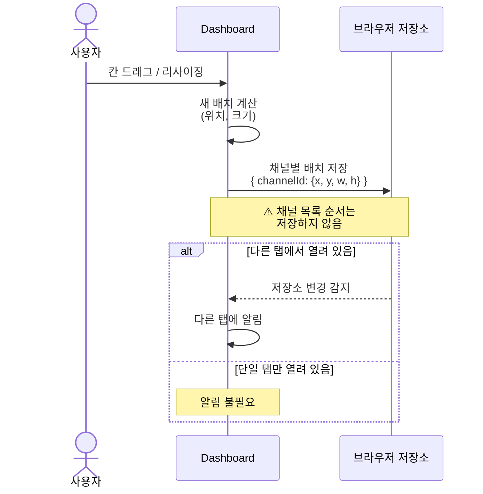
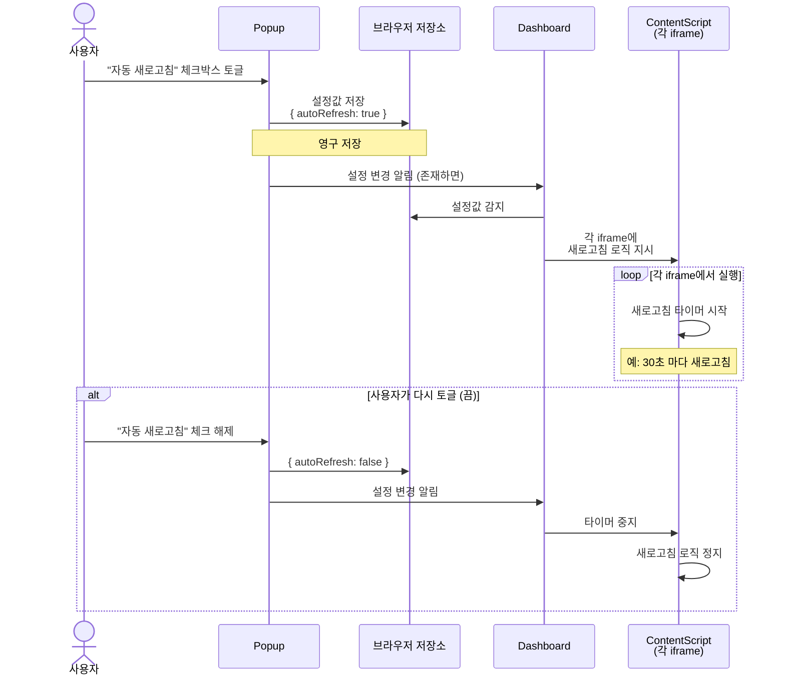

[설계서](../../README.md) › [Process-Viewpoint](README.md) › Flows-UserInteractions

# 사용자 상호작용 흐름

> **다루는 내용:** 사용자가 UI와 상호작용할 때의 메시지 시퀀스
> **갱신 트리거:** 사용자 조작에 따른 메시지 흐름이 변경될 때

---

## 1. 채널 추가 흐름

사용자가 팝업에서 채널을 추가할 때:

**포인트:**
- ✅ Popup에서 즉시 저장소에 기록
- ✅ Dashboard에 알림만 전송 (UI 변경은 안 함)
- ✅ `멀티뷰 대시보드 열기` 시점에 최종 반영

---

## 2. 팔로잉 목록 조회 흐름

사용자가 팝업에서 "팔로잉 불러오기" 버튼을 눌렀을 때:

**포인트:**
- 🔒 **권한 분리:** Popup은 쿠키/네트워크 접근 불가 → Background 요청 필수
- 🔄 **플랫폼 추상화:** Platforms가 Chzzk/SOOP 차이 흡수
- 📨 **비동기 통신:** 메시지 기반 request-response 패턴

---

## 3. 화면 조작 흐름 (음량 제어)

사용자가 대시보드에서 음량을 조절했을 때:

**포인트:**
- 🚫 **제약:** Dashboard는 **iframe 내부에 직접 접근 불가** (CORS)
- 🔗 **중계:** ContentScript가 유일한 접근 통로
- ↔️ **양방향:** Dashboard → ContentScript → 화면 조작 → 상태 보고

---

## 4. 배치 저장 흐름

사용자가 대시보드에서 칸을 이동/리사이징했을 때:

**포인트:**
- 📍 **채널별 독립 저장:** 각 채널이 **자신의 위치를 기억**
- 🔄 **순서 무관:** 팝업에서 목록 순서를 바꿔도 배치는 유지
- 🔔 **실시간 동기화:** 저장소 감지로 다른 탭에 반영

---

## 5. 설정 변경 흐름

사용자가 팝업에서 "자동 새로고침" 설정을 켰을 때:

**포인트:**
- ⚙️ **영구 저장:** 설정은 저장소에 기록되어 다음 실행에서 복원
- 🔄 **실시간 반영:** Popup 변경 → Dashboard 감지 → ContentScript 실행
- 🎯 **각 iframe 독립:** 각 채널이 설정을 독립적으로 실행
