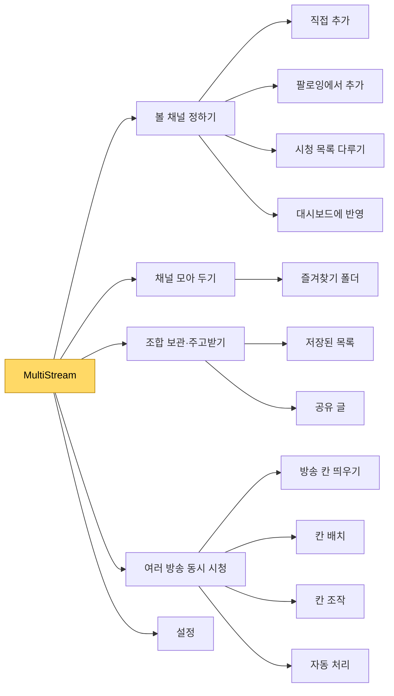

[설계서](../../README.md) › 요구사항

# 요구사항

> **다루는 내용:** 완성본이 무엇을 하는가. 요소 분해 트리와 요구사항 문서 목록
> **갱신 트리거:** 기능이 추가·제거되거나 요소 분해 트리가 바뀔 때

이 영역은 **무엇을** 하는지만 적는다. 무엇으로 만들었는지는 [구현](../Implementation/README.md)에 있다. 다른 언어·도구로 다시 만들어도 이 영역의 문장은 그대로 맞아야 한다.

## 요소 분해 트리

완성본이 하는 일을 큰 가지에서 작은 가지로 나눈 것이다. 문서를 어디에 둘지와 무엇이 중복인지를 이 트리로 판정한다.

## 문서 목록

| 문서 | 다루는 내용 |
|---|---|
| [기능](Functions/README.md) | 트리의 각 요소가 하는 일과 기대 동작 |
| [외부 인터페이스](External-Interfaces/README.md) | 사용자 화면, 치지직·SOOP과의 접점 |
| [데이터](Data.md) | 저장하는 데이터의 종류·모양·의미 |
| [제약](Constraints.md) | 반드시 지켜야 하는 외부 조건 |
| [품질 속성](Quality-Attributes.md) | 끊김·보안·호환성 등 동작 방식에 걸린 요구 |
